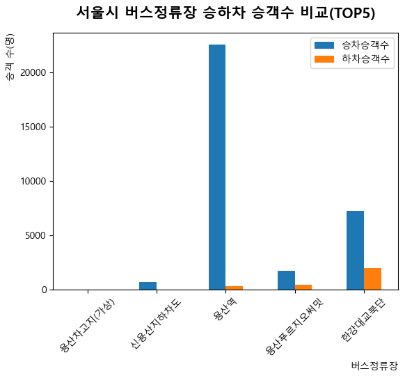
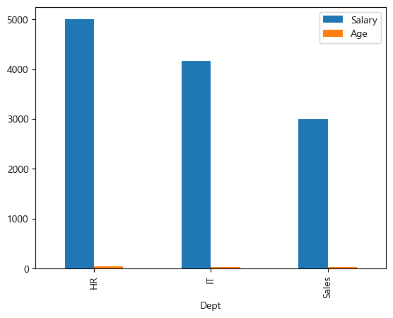
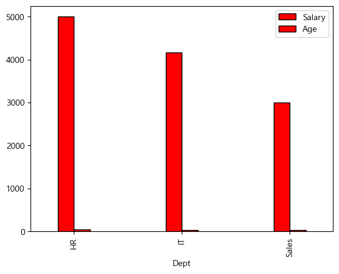
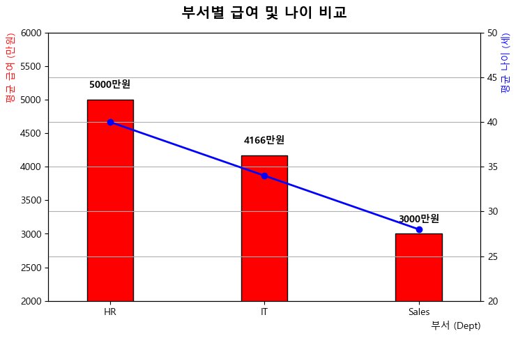
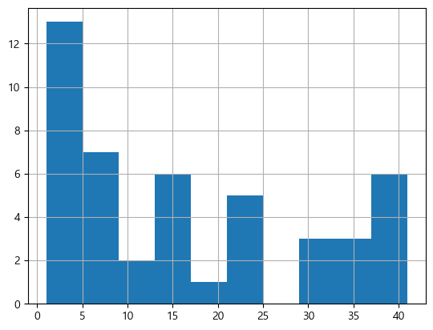
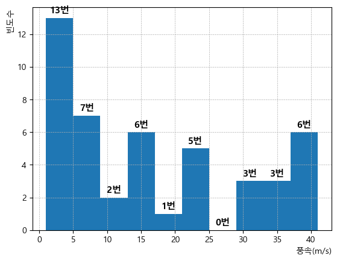

# **20260704-토요실습1**

### 먼저 전체를 출력


```python
import matplotlib.pyplot as plt       # 맷플롯리브 시각화
import pandas as pd                   # 판다스 데이터분석
import numpy as np                    # 넘파이 수학계산
                                      # 버스 스테이션이란 함수에, 시트 네임을 버스 스테이션으로 한 서울 트래픽 xlsx 파일을 읽을 결과를 저장한다. 변수이다.
bus_station=pd.read_excel('seoul_traffic_202605.xlsx', sheet_name='bus_station')      
```


```python
import matplotlib.pyplot as plt
import pandas as pd
import numpy as np

bus_station=pd.read_excel('seoul_traffic_202605.xlsx', sheet_name='bus_station')
bus_station
```


<div>
<style scoped>
    .dataframe tbody tr th:only-of-type {
        vertical-align: middle;
    }

    .dataframe tbody tr th {
        vertical-align: top;
    }

    .dataframe thead th {
        text-align: right;
    }
</style>
<table border="1" class="dataframe">
  <thead>
    <tr style="text-align: right;">
      <th></th>
      <th>사용월</th>
      <th>노선ID</th>
      <th>노선번호</th>
      <th>노선명</th>
      <th>버스정류장ID</th>
      <th>버스정류장명</th>
      <th>승차승객수</th>
      <th>하차승객수</th>
    </tr>
  </thead>
  <tbody>
    <tr>
      <th>0</th>
      <td>2026-05</td>
      <td>11110897</td>
      <td>17</td>
      <td>0017번(용산차고지~신용산역3번출구)</td>
      <td>8503228</td>
      <td>용산차고지(가상)</td>
      <td>25</td>
      <td>5</td>
    </tr>
    <tr>
      <th>1</th>
      <td>2026-05</td>
      <td>11110897</td>
      <td>17</td>
      <td>0017번(용산차고지~신용산역3번출구)</td>
      <td>8503189</td>
      <td>신용산지하차도</td>
      <td>735</td>
      <td>21</td>
    </tr>
    <tr>
      <th>2</th>
      <td>2026-05</td>
      <td>11110897</td>
      <td>17</td>
      <td>0017번(용산차고지~신용산역3번출구)</td>
      <td>72992</td>
      <td>용산역</td>
      <td>22519</td>
      <td>352</td>
    </tr>
    <tr>
      <th>3</th>
      <td>2026-05</td>
      <td>11110897</td>
      <td>17</td>
      <td>0017번(용산차고지~신용산역3번출구)</td>
      <td>72314</td>
      <td>용산푸르지오써밋</td>
      <td>1782</td>
      <td>488</td>
    </tr>
    <tr>
      <th>4</th>
      <td>2026-05</td>
      <td>11110897</td>
      <td>17</td>
      <td>0017번(용산차고지~신용산역3번출구)</td>
      <td>72993</td>
      <td>한강대교북단</td>
      <td>7261</td>
      <td>1998</td>
    </tr>
    <tr>
      <th>...</th>
      <td>...</td>
      <td>...</td>
      <td>...</td>
      <td>...</td>
      <td>...</td>
      <td>...</td>
      <td>...</td>
      <td>...</td>
    </tr>
    <tr>
      <th>41995</th>
      <td>2026-05</td>
      <td>92000001</td>
      <td>한강버스01</td>
      <td>한강버스01(마곡~잠실)</td>
      <td>8503213</td>
      <td>압구정</td>
      <td>4899</td>
      <td>3375</td>
    </tr>
    <tr>
      <th>41996</th>
      <td>2026-05</td>
      <td>92000001</td>
      <td>한강버스01</td>
      <td>한강버스01(마곡~잠실)</td>
      <td>8503214</td>
      <td>옥수</td>
      <td>5891</td>
      <td>3566</td>
    </tr>
    <tr>
      <th>41997</th>
      <td>2026-05</td>
      <td>92000001</td>
      <td>한강버스01</td>
      <td>한강버스01(마곡~잠실)</td>
      <td>8503414</td>
      <td>성수</td>
      <td>4</td>
      <td>4</td>
    </tr>
    <tr>
      <th>41998</th>
      <td>2026-05</td>
      <td>92000001</td>
      <td>한강버스01</td>
      <td>한강버스01(마곡~잠실)</td>
      <td>8503215</td>
      <td>뚝섬</td>
      <td>8736</td>
      <td>6459</td>
    </tr>
    <tr>
      <th>41999</th>
      <td>2026-05</td>
      <td>92000001</td>
      <td>한강버스01</td>
      <td>한강버스01(마곡~잠실)</td>
      <td>8503216</td>
      <td>잠실</td>
      <td>9667</td>
      <td>12434</td>
    </tr>
  </tbody>
</table>
<p>42000 rows × 8 columns</p>
</div>


```python

```

### 선택 출력


```python
bus_station[['버스정류장ID', '승차승객수']] # 두 가지 열만 선택
```


<div>
<style scoped>
    .dataframe tbody tr th:only-of-type {
        vertical-align: middle;
    }

    .dataframe tbody tr th {
        vertical-align: top;
    }

    .dataframe thead th {
        text-align: right;
    }
</style>
<table border="1" class="dataframe">
  <thead>
    <tr style="text-align: right;">
      <th></th>
      <th>버스정류장ID</th>
      <th>승차승객수</th>
    </tr>
  </thead>
  <tbody>
    <tr>
      <th>0</th>
      <td>8503228</td>
      <td>25</td>
    </tr>
    <tr>
      <th>1</th>
      <td>8503189</td>
      <td>735</td>
    </tr>
    <tr>
      <th>2</th>
      <td>72992</td>
      <td>22519</td>
    </tr>
    <tr>
      <th>3</th>
      <td>72314</td>
      <td>1782</td>
    </tr>
    <tr>
      <th>4</th>
      <td>72993</td>
      <td>7261</td>
    </tr>
    <tr>
      <th>...</th>
      <td>...</td>
      <td>...</td>
    </tr>
    <tr>
      <th>41995</th>
      <td>8503213</td>
      <td>4899</td>
    </tr>
    <tr>
      <th>41996</th>
      <td>8503214</td>
      <td>5891</td>
    </tr>
    <tr>
      <th>41997</th>
      <td>8503414</td>
      <td>4</td>
    </tr>
    <tr>
      <th>41998</th>
      <td>8503215</td>
      <td>8736</td>
    </tr>
    <tr>
      <th>41999</th>
      <td>8503216</td>
      <td>9667</td>
    </tr>
  </tbody>
</table>
<p>42000 rows × 2 columns</p>
</div>


```python
bus_station[['노선번호', '노선명']] # 두 가지 열만 선택
```


<div>
<style scoped>
    .dataframe tbody tr th:only-of-type {
        vertical-align: middle;
    }

    .dataframe tbody tr th {
        vertical-align: top;
    }

    .dataframe thead th {
        text-align: right;
    }
</style>
<table border="1" class="dataframe">
  <thead>
    <tr style="text-align: right;">
      <th></th>
      <th>노선번호</th>
      <th>노선명</th>
    </tr>
  </thead>
  <tbody>
    <tr>
      <th>0</th>
      <td>17</td>
      <td>0017번(용산차고지~신용산역3번출구)</td>
    </tr>
    <tr>
      <th>1</th>
      <td>17</td>
      <td>0017번(용산차고지~신용산역3번출구)</td>
    </tr>
    <tr>
      <th>2</th>
      <td>17</td>
      <td>0017번(용산차고지~신용산역3번출구)</td>
    </tr>
    <tr>
      <th>3</th>
      <td>17</td>
      <td>0017번(용산차고지~신용산역3번출구)</td>
    </tr>
    <tr>
      <th>4</th>
      <td>17</td>
      <td>0017번(용산차고지~신용산역3번출구)</td>
    </tr>
    <tr>
      <th>...</th>
      <td>...</td>
      <td>...</td>
    </tr>
    <tr>
      <th>41995</th>
      <td>한강버스01</td>
      <td>한강버스01(마곡~잠실)</td>
    </tr>
    <tr>
      <th>41996</th>
      <td>한강버스01</td>
      <td>한강버스01(마곡~잠실)</td>
    </tr>
    <tr>
      <th>41997</th>
      <td>한강버스01</td>
      <td>한강버스01(마곡~잠실)</td>
    </tr>
    <tr>
      <th>41998</th>
      <td>한강버스01</td>
      <td>한강버스01(마곡~잠실)</td>
    </tr>
    <tr>
      <th>41999</th>
      <td>한강버스01</td>
      <td>한강버스01(마곡~잠실)</td>
    </tr>
  </tbody>
</table>
<p>42000 rows × 2 columns</p>
</div>


```python
bus_station[['노선번호','노선명','버스정류장ID','버스정류장명','승차승객수','하차승객수']] # 출력하고픈 열들을 지정
```


<div>
<style scoped>
    .dataframe tbody tr th:only-of-type {
        vertical-align: middle;
    }

    .dataframe tbody tr th {
        vertical-align: top;
    }

    .dataframe thead th {
        text-align: right;
    }
</style>
<table border="1" class="dataframe">
  <thead>
    <tr style="text-align: right;">
      <th></th>
      <th>노선번호</th>
      <th>노선명</th>
      <th>버스정류장ID</th>
      <th>버스정류장명</th>
      <th>승차승객수</th>
      <th>하차승객수</th>
    </tr>
  </thead>
  <tbody>
    <tr>
      <th>0</th>
      <td>17</td>
      <td>0017번(용산차고지~신용산역3번출구)</td>
      <td>8503228</td>
      <td>용산차고지(가상)</td>
      <td>25</td>
      <td>5</td>
    </tr>
    <tr>
      <th>1</th>
      <td>17</td>
      <td>0017번(용산차고지~신용산역3번출구)</td>
      <td>8503189</td>
      <td>신용산지하차도</td>
      <td>735</td>
      <td>21</td>
    </tr>
    <tr>
      <th>2</th>
      <td>17</td>
      <td>0017번(용산차고지~신용산역3번출구)</td>
      <td>72992</td>
      <td>용산역</td>
      <td>22519</td>
      <td>352</td>
    </tr>
    <tr>
      <th>3</th>
      <td>17</td>
      <td>0017번(용산차고지~신용산역3번출구)</td>
      <td>72314</td>
      <td>용산푸르지오써밋</td>
      <td>1782</td>
      <td>488</td>
    </tr>
    <tr>
      <th>4</th>
      <td>17</td>
      <td>0017번(용산차고지~신용산역3번출구)</td>
      <td>72993</td>
      <td>한강대교북단</td>
      <td>7261</td>
      <td>1998</td>
    </tr>
    <tr>
      <th>...</th>
      <td>...</td>
      <td>...</td>
      <td>...</td>
      <td>...</td>
      <td>...</td>
      <td>...</td>
    </tr>
    <tr>
      <th>41995</th>
      <td>한강버스01</td>
      <td>한강버스01(마곡~잠실)</td>
      <td>8503213</td>
      <td>압구정</td>
      <td>4899</td>
      <td>3375</td>
    </tr>
    <tr>
      <th>41996</th>
      <td>한강버스01</td>
      <td>한강버스01(마곡~잠실)</td>
      <td>8503214</td>
      <td>옥수</td>
      <td>5891</td>
      <td>3566</td>
    </tr>
    <tr>
      <th>41997</th>
      <td>한강버스01</td>
      <td>한강버스01(마곡~잠실)</td>
      <td>8503414</td>
      <td>성수</td>
      <td>4</td>
      <td>4</td>
    </tr>
    <tr>
      <th>41998</th>
      <td>한강버스01</td>
      <td>한강버스01(마곡~잠실)</td>
      <td>8503215</td>
      <td>뚝섬</td>
      <td>8736</td>
      <td>6459</td>
    </tr>
    <tr>
      <th>41999</th>
      <td>한강버스01</td>
      <td>한강버스01(마곡~잠실)</td>
      <td>8503216</td>
      <td>잠실</td>
      <td>9667</td>
      <td>12434</td>
    </tr>
  </tbody>
</table>
<p>42000 rows × 6 columns</p>
</div>


```python
bus_station[['노선번호','노선명','버스정류장ID','버스정류장명','승차승객수','하차승객수']].head(9)   # 상위 9 라인만 출력
```


<div>
<style scoped>
    .dataframe tbody tr th:only-of-type {
        vertical-align: middle;
    }

    .dataframe tbody tr th {
        vertical-align: top;
    }

    .dataframe thead th {
        text-align: right;
    }
</style>
<table border="1" class="dataframe">
  <thead>
    <tr style="text-align: right;">
      <th></th>
      <th>노선번호</th>
      <th>노선명</th>
      <th>버스정류장ID</th>
      <th>버스정류장명</th>
      <th>승차승객수</th>
      <th>하차승객수</th>
    </tr>
  </thead>
  <tbody>
    <tr>
      <th>0</th>
      <td>17</td>
      <td>0017번(용산차고지~신용산역3번출구)</td>
      <td>8503228</td>
      <td>용산차고지(가상)</td>
      <td>25</td>
      <td>5</td>
    </tr>
    <tr>
      <th>1</th>
      <td>17</td>
      <td>0017번(용산차고지~신용산역3번출구)</td>
      <td>8503189</td>
      <td>신용산지하차도</td>
      <td>735</td>
      <td>21</td>
    </tr>
    <tr>
      <th>2</th>
      <td>17</td>
      <td>0017번(용산차고지~신용산역3번출구)</td>
      <td>72992</td>
      <td>용산역</td>
      <td>22519</td>
      <td>352</td>
    </tr>
    <tr>
      <th>3</th>
      <td>17</td>
      <td>0017번(용산차고지~신용산역3번출구)</td>
      <td>72314</td>
      <td>용산푸르지오써밋</td>
      <td>1782</td>
      <td>488</td>
    </tr>
    <tr>
      <th>4</th>
      <td>17</td>
      <td>0017번(용산차고지~신용산역3번출구)</td>
      <td>72993</td>
      <td>한강대교북단</td>
      <td>7261</td>
      <td>1998</td>
    </tr>
    <tr>
      <th>5</th>
      <td>17</td>
      <td>0017번(용산차고지~신용산역3번출구)</td>
      <td>72994</td>
      <td>서부이촌동입구</td>
      <td>2703</td>
      <td>8094</td>
    </tr>
    <tr>
      <th>6</th>
      <td>17</td>
      <td>0017번(용산차고지~신용산역3번출구)</td>
      <td>72995</td>
      <td>이촌2동대림아파트.새남터성지</td>
      <td>1602</td>
      <td>7579</td>
    </tr>
    <tr>
      <th>7</th>
      <td>17</td>
      <td>0017번(용산차고지~신용산역3번출구)</td>
      <td>72996</td>
      <td>이촌2동주민센터</td>
      <td>1605</td>
      <td>5088</td>
    </tr>
    <tr>
      <th>8</th>
      <td>17</td>
      <td>0017번(용산차고지~신용산역3번출구)</td>
      <td>72997</td>
      <td>이촌로입구.성촌공원앞</td>
      <td>389</td>
      <td>1298</td>
    </tr>
  </tbody>
</table>
</div>


### 이름(Label)으로 접근하느냐(loc), 위치를 나타내는 정수(Integer)로 접근하느냐(iloc)


```python
bus_station.iloc[1:5]
```


<div>
<style scoped>
    .dataframe tbody tr th:only-of-type {
        vertical-align: middle;
    }

    .dataframe tbody tr th {
        vertical-align: top;
    }

    .dataframe thead th {
        text-align: right;
    }
</style>
<table border="1" class="dataframe">
  <thead>
    <tr style="text-align: right;">
      <th></th>
      <th>사용월</th>
      <th>노선ID</th>
      <th>노선번호</th>
      <th>노선명</th>
      <th>버스정류장ID</th>
      <th>버스정류장명</th>
      <th>승차승객수</th>
      <th>하차승객수</th>
    </tr>
  </thead>
  <tbody>
    <tr>
      <th>1</th>
      <td>2026-05</td>
      <td>11110897</td>
      <td>17</td>
      <td>0017번(용산차고지~신용산역3번출구)</td>
      <td>8503189</td>
      <td>신용산지하차도</td>
      <td>735</td>
      <td>21</td>
    </tr>
    <tr>
      <th>2</th>
      <td>2026-05</td>
      <td>11110897</td>
      <td>17</td>
      <td>0017번(용산차고지~신용산역3번출구)</td>
      <td>72992</td>
      <td>용산역</td>
      <td>22519</td>
      <td>352</td>
    </tr>
    <tr>
      <th>3</th>
      <td>2026-05</td>
      <td>11110897</td>
      <td>17</td>
      <td>0017번(용산차고지~신용산역3번출구)</td>
      <td>72314</td>
      <td>용산푸르지오써밋</td>
      <td>1782</td>
      <td>488</td>
    </tr>
    <tr>
      <th>4</th>
      <td>2026-05</td>
      <td>11110897</td>
      <td>17</td>
      <td>0017번(용산차고지~신용산역3번출구)</td>
      <td>72993</td>
      <td>한강대교북단</td>
      <td>7261</td>
      <td>1998</td>
    </tr>
  </tbody>
</table>
</div>


```python

```

### loc iloc practice


```python
bus_station.iloc[1]
```


    사용월                      2026-05
    노선ID                    11110897
    노선번호                          17
    노선명        0017번(용산차고지~신용산역3번출구)
    버스정류장ID                  8503189
    버스정류장명                   신용산지하차도
    승차승객수                        735
    하차승객수                         21
    Name: 1, dtype: object


```python
bus_station.iloc[[1,2]]     # 복수는 두개의 대괄호
```


<div>
<style scoped>
    .dataframe tbody tr th:only-of-type {
        vertical-align: middle;
    }

    .dataframe tbody tr th {
        vertical-align: top;
    }

    .dataframe thead th {
        text-align: right;
    }
</style>
<table border="1" class="dataframe">
  <thead>
    <tr style="text-align: right;">
      <th></th>
      <th>사용월</th>
      <th>노선ID</th>
      <th>노선번호</th>
      <th>노선명</th>
      <th>버스정류장ID</th>
      <th>버스정류장명</th>
      <th>승차승객수</th>
      <th>하차승객수</th>
    </tr>
  </thead>
  <tbody>
    <tr>
      <th>1</th>
      <td>2026-05</td>
      <td>11110897</td>
      <td>17</td>
      <td>0017번(용산차고지~신용산역3번출구)</td>
      <td>8503189</td>
      <td>신용산지하차도</td>
      <td>735</td>
      <td>21</td>
    </tr>
    <tr>
      <th>2</th>
      <td>2026-05</td>
      <td>11110897</td>
      <td>17</td>
      <td>0017번(용산차고지~신용산역3번출구)</td>
      <td>72992</td>
      <td>용산역</td>
      <td>22519</td>
      <td>352</td>
    </tr>
  </tbody>
</table>
</div>


```python
bus_station.loc[0:3, '버스정류장명':'하차승객수']        # 버스정류장명  부터 하차승객수 사이의(포함) 모든 열을 선택하며, 0번부터 3번째 행까지 출력한다.
```


<div>
<style scoped>
    .dataframe tbody tr th:only-of-type {
        vertical-align: middle;
    }

    .dataframe tbody tr th {
        vertical-align: top;
    }

    .dataframe thead th {
        text-align: right;
    }
</style>
<table border="1" class="dataframe">
  <thead>
    <tr style="text-align: right;">
      <th></th>
      <th>버스정류장명</th>
      <th>승차승객수</th>
      <th>하차승객수</th>
    </tr>
  </thead>
  <tbody>
    <tr>
      <th>0</th>
      <td>용산차고지(가상)</td>
      <td>25</td>
      <td>5</td>
    </tr>
    <tr>
      <th>1</th>
      <td>신용산지하차도</td>
      <td>735</td>
      <td>21</td>
    </tr>
    <tr>
      <th>2</th>
      <td>용산역</td>
      <td>22519</td>
      <td>352</td>
    </tr>
    <tr>
      <th>3</th>
      <td>용산푸르지오써밋</td>
      <td>1782</td>
      <td>488</td>
    </tr>
  </tbody>
</table>
</div>


```python
bus_station.loc[0:4, '버스정류장명':'하차승객수']
```


<div>
<style scoped>
    .dataframe tbody tr th:only-of-type {
        vertical-align: middle;
    }

    .dataframe tbody tr th {
        vertical-align: top;
    }

    .dataframe thead th {
        text-align: right;
    }
</style>
<table border="1" class="dataframe">
  <thead>
    <tr style="text-align: right;">
      <th></th>
      <th>버스정류장명</th>
      <th>승차승객수</th>
      <th>하차승객수</th>
    </tr>
  </thead>
  <tbody>
    <tr>
      <th>0</th>
      <td>용산차고지(가상)</td>
      <td>25</td>
      <td>5</td>
    </tr>
    <tr>
      <th>1</th>
      <td>신용산지하차도</td>
      <td>735</td>
      <td>21</td>
    </tr>
    <tr>
      <th>2</th>
      <td>용산역</td>
      <td>22519</td>
      <td>352</td>
    </tr>
    <tr>
      <th>3</th>
      <td>용산푸르지오써밋</td>
      <td>1782</td>
      <td>488</td>
    </tr>
    <tr>
      <th>4</th>
      <td>한강대교북단</td>
      <td>7261</td>
      <td>1998</td>
    </tr>
  </tbody>
</table>
</div>


### 소트 정렬하기


```python
bus_station.sort_values(by='승차승객수', ascending=False)        # 승차승객수가 제일 큰 대로 내림차순 카운트다운
```


<div>
<style scoped>
    .dataframe tbody tr th:only-of-type {
        vertical-align: middle;
    }

    .dataframe tbody tr th {
        vertical-align: top;
    }

    .dataframe thead th {
        text-align: right;
    }
</style>
<table border="1" class="dataframe">
  <thead>
    <tr style="text-align: right;">
      <th></th>
      <th>사용월</th>
      <th>노선ID</th>
      <th>노선번호</th>
      <th>노선명</th>
      <th>버스정류장ID</th>
      <th>버스정류장명</th>
      <th>승차승객수</th>
      <th>하차승객수</th>
    </tr>
  </thead>
  <tbody>
    <tr>
      <th>37425</th>
      <td>2026-05</td>
      <td>11110590</td>
      <td>동대문01</td>
      <td>동대문01(회기역~경희의료원)</td>
      <td>9008470</td>
      <td>회기역</td>
      <td>128886</td>
      <td>62014</td>
    </tr>
    <tr>
      <th>40809</th>
      <td>2026-05</td>
      <td>11110696</td>
      <td>양천01</td>
      <td>양천01(등촌역~당산역)</td>
      <td>9008732</td>
      <td>당산역.지하철2호선</td>
      <td>95796</td>
      <td>75634</td>
    </tr>
    <tr>
      <th>38710</th>
      <td>2026-05</td>
      <td>11110641</td>
      <td>서대문03</td>
      <td>서대문03(홍은2동주민센터~신촌역)</td>
      <td>9013927</td>
      <td>신촌전철역</td>
      <td>91035</td>
      <td>30804</td>
    </tr>
    <tr>
      <th>37428</th>
      <td>2026-05</td>
      <td>11110590</td>
      <td>동대문01</td>
      <td>동대문01(회기역~경희의료원)</td>
      <td>9011737</td>
      <td>경희대의료원</td>
      <td>84937</td>
      <td>82737</td>
    </tr>
    <tr>
      <th>49</th>
      <td>2026-05</td>
      <td>11110475</td>
      <td>01A</td>
      <td>01A번(예장주차장~예장주차장)</td>
      <td>77296</td>
      <td>남산서울타워</td>
      <td>81252</td>
      <td>62410</td>
    </tr>
    <tr>
      <th>...</th>
      <td>...</td>
      <td>...</td>
      <td>...</td>
      <td>...</td>
      <td>...</td>
      <td>...</td>
      <td>...</td>
      <td>...</td>
    </tr>
    <tr>
      <th>31655</th>
      <td>2026-05</td>
      <td>41110152</td>
      <td>N37</td>
      <td>N37번(송파공영차고지~진관공영차고지)</td>
      <td>9010867</td>
      <td>복정역환승주차장</td>
      <td>0</td>
      <td>282</td>
    </tr>
    <tr>
      <th>6428</th>
      <td>2026-05</td>
      <td>11110358</td>
      <td>2016</td>
      <td>2016번(중랑차고지~이촌2동)</td>
      <td>7000038</td>
      <td>중랑공영차고지(가상)</td>
      <td>0</td>
      <td>17</td>
    </tr>
    <tr>
      <th>6288</th>
      <td>2026-05</td>
      <td>11110175</td>
      <td>2015</td>
      <td>2015번(신내공영차고지~동대문운동장)</td>
      <td>32570</td>
      <td>중랑공영차고지(가상)</td>
      <td>0</td>
      <td>20</td>
    </tr>
    <tr>
      <th>39221</th>
      <td>2026-05</td>
      <td>11410025</td>
      <td>서울09퇴근</td>
      <td>서울09퇴근(노원역~의정부시고산지구)</td>
      <td>8503180</td>
      <td>민락교</td>
      <td>0</td>
      <td>44</td>
    </tr>
    <tr>
      <th>39220</th>
      <td>2026-05</td>
      <td>11410025</td>
      <td>서울09퇴근</td>
      <td>서울09퇴근(노원역~의정부시고산지구)</td>
      <td>8503179</td>
      <td>정음마을고산2단지.고산종합사회복지관</td>
      <td>0</td>
      <td>56</td>
    </tr>
  </tbody>
</table>
<p>42000 rows × 8 columns</p>
</div>


```python
bus_station.sort_values(by='승차승객수', ascending=True)        # 승차승객수가 제일 작은대로 오름차순 카운트다운
```


<div>
<style scoped>
    .dataframe tbody tr th:only-of-type {
        vertical-align: middle;
    }

    .dataframe tbody tr th {
        vertical-align: top;
    }

    .dataframe thead th {
        text-align: right;
    }
</style>
<table border="1" class="dataframe">
  <thead>
    <tr style="text-align: right;">
      <th></th>
      <th>사용월</th>
      <th>노선ID</th>
      <th>노선번호</th>
      <th>노선명</th>
      <th>버스정류장ID</th>
      <th>버스정류장명</th>
      <th>승차승객수</th>
      <th>하차승객수</th>
    </tr>
  </thead>
  <tbody>
    <tr>
      <th>30548</th>
      <td>2026-05</td>
      <td>11110378</td>
      <td>N15</td>
      <td>N15번(우이동성원아파트~남태령역)</td>
      <td>8502312</td>
      <td>사당자동차학원</td>
      <td>0</td>
      <td>40</td>
    </tr>
    <tr>
      <th>21321</th>
      <td>2026-05</td>
      <td>11110835</td>
      <td>6611</td>
      <td>6611번(개화역광역환승센터~한강버스마곡선착장)</td>
      <td>8502032</td>
      <td>강서공영차고지(종점가상)</td>
      <td>0</td>
      <td>2</td>
    </tr>
    <tr>
      <th>24864</th>
      <td>2026-05</td>
      <td>41110011</td>
      <td>702A</td>
      <td>702A번(원당~종로1가)</td>
      <td>8502693</td>
      <td>숭례문(가상)</td>
      <td>0</td>
      <td>623</td>
    </tr>
    <tr>
      <th>29123</th>
      <td>2026-05</td>
      <td>91000042</td>
      <td>8773구산출</td>
      <td>8773구산출근(구산동~홍대입구역)</td>
      <td>8502690</td>
      <td>홍대입구역(가상)</td>
      <td>0</td>
      <td>118</td>
    </tr>
    <tr>
      <th>29269</th>
      <td>2026-05</td>
      <td>91000043</td>
      <td>8773홍대출</td>
      <td>8773홍대출근(홍대입구역~구산동)</td>
      <td>9339</td>
      <td>구산동주민센터</td>
      <td>0</td>
      <td>5</td>
    </tr>
    <tr>
      <th>...</th>
      <td>...</td>
      <td>...</td>
      <td>...</td>
      <td>...</td>
      <td>...</td>
      <td>...</td>
      <td>...</td>
      <td>...</td>
    </tr>
    <tr>
      <th>49</th>
      <td>2026-05</td>
      <td>11110475</td>
      <td>01A</td>
      <td>01A번(예장주차장~예장주차장)</td>
      <td>77296</td>
      <td>남산서울타워</td>
      <td>81252</td>
      <td>62410</td>
    </tr>
    <tr>
      <th>37428</th>
      <td>2026-05</td>
      <td>11110590</td>
      <td>동대문01</td>
      <td>동대문01(회기역~경희의료원)</td>
      <td>9011737</td>
      <td>경희대의료원</td>
      <td>84937</td>
      <td>82737</td>
    </tr>
    <tr>
      <th>38710</th>
      <td>2026-05</td>
      <td>11110641</td>
      <td>서대문03</td>
      <td>서대문03(홍은2동주민센터~신촌역)</td>
      <td>9013927</td>
      <td>신촌전철역</td>
      <td>91035</td>
      <td>30804</td>
    </tr>
    <tr>
      <th>40809</th>
      <td>2026-05</td>
      <td>11110696</td>
      <td>양천01</td>
      <td>양천01(등촌역~당산역)</td>
      <td>9008732</td>
      <td>당산역.지하철2호선</td>
      <td>95796</td>
      <td>75634</td>
    </tr>
    <tr>
      <th>37425</th>
      <td>2026-05</td>
      <td>11110590</td>
      <td>동대문01</td>
      <td>동대문01(회기역~경희의료원)</td>
      <td>9008470</td>
      <td>회기역</td>
      <td>128886</td>
      <td>62014</td>
    </tr>
  </tbody>
</table>
<p>42000 rows × 8 columns</p>
</div>


### 인덱스는 데이터를 찾는 기준이다


```python
boarding=bus_station[['버스정류장명','승차승객수','하차승객수']]         # 버스정류장명 승차승객수 하차승객수만 출력하고 boaring 이란 변수에 저장하고 그 변수를 출력
boarding.index=boarding['버스정류장명']                                  # 그리고 그 변수의 인덱스는 버스정류장명으로 한다.
boarding                                                                 # 그리고 그 변수를 출력
```


<div>
<style scoped>
    .dataframe tbody tr th:only-of-type {
        vertical-align: middle;
    }

    .dataframe tbody tr th {
        vertical-align: top;
    }

    .dataframe thead th {
        text-align: right;
    }
</style>
<table border="1" class="dataframe">
  <thead>
    <tr style="text-align: right;">
      <th></th>
      <th>버스정류장명</th>
      <th>승차승객수</th>
      <th>하차승객수</th>
    </tr>
    <tr>
      <th>버스정류장명</th>
      <th></th>
      <th></th>
      <th></th>
    </tr>
  </thead>
  <tbody>
    <tr>
      <th>용산차고지(가상)</th>
      <td>용산차고지(가상)</td>
      <td>25</td>
      <td>5</td>
    </tr>
    <tr>
      <th>신용산지하차도</th>
      <td>신용산지하차도</td>
      <td>735</td>
      <td>21</td>
    </tr>
    <tr>
      <th>용산역</th>
      <td>용산역</td>
      <td>22519</td>
      <td>352</td>
    </tr>
    <tr>
      <th>용산푸르지오써밋</th>
      <td>용산푸르지오써밋</td>
      <td>1782</td>
      <td>488</td>
    </tr>
    <tr>
      <th>한강대교북단</th>
      <td>한강대교북단</td>
      <td>7261</td>
      <td>1998</td>
    </tr>
    <tr>
      <th>...</th>
      <td>...</td>
      <td>...</td>
      <td>...</td>
    </tr>
    <tr>
      <th>압구정</th>
      <td>압구정</td>
      <td>4899</td>
      <td>3375</td>
    </tr>
    <tr>
      <th>옥수</th>
      <td>옥수</td>
      <td>5891</td>
      <td>3566</td>
    </tr>
    <tr>
      <th>성수</th>
      <td>성수</td>
      <td>4</td>
      <td>4</td>
    </tr>
    <tr>
      <th>뚝섬</th>
      <td>뚝섬</td>
      <td>8736</td>
      <td>6459</td>
    </tr>
    <tr>
      <th>잠실</th>
      <td>잠실</td>
      <td>9667</td>
      <td>12434</td>
    </tr>
  </tbody>
</table>
<p>42000 rows × 3 columns</p>
</div>


```python
boarding.loc['용산역']   # boarding 변수에서 용산역에 대하여 값 모두 출력
```


<div>
<style scoped>
    .dataframe tbody tr th:only-of-type {
        vertical-align: middle;
    }

    .dataframe tbody tr th {
        vertical-align: top;
    }

    .dataframe thead th {
        text-align: right;
    }
</style>
<table border="1" class="dataframe">
  <thead>
    <tr style="text-align: right;">
      <th></th>
      <th>버스정류장명</th>
      <th>승차승객수</th>
      <th>하차승객수</th>
    </tr>
    <tr>
      <th>버스정류장명</th>
      <th></th>
      <th></th>
      <th></th>
    </tr>
  </thead>
  <tbody>
    <tr>
      <th>용산역</th>
      <td>용산역</td>
      <td>22519</td>
      <td>352</td>
    </tr>
    <tr>
      <th>용산역</th>
      <td>용산역</td>
      <td>3614</td>
      <td>73</td>
    </tr>
    <tr>
      <th>용산역</th>
      <td>용산역</td>
      <td>26481</td>
      <td>11246</td>
    </tr>
    <tr>
      <th>용산역</th>
      <td>용산역</td>
      <td>18543</td>
      <td>6505</td>
    </tr>
  </tbody>
</table>
</div>


### 그래프 시각화(boarding 함수)


```python
boarding[['승차승객수','하차승객수']].head().plot(kind='bar', rot=45)                                 # boaring 에서 승차승객수 하차승객수만 뽑고 그것에서 상위 5개만 뽑고 이것을 플롯 차트 중 바 스타일로 시각화, (그리고 아래 텍스트는 45도 기울임)
plt.rc('font', family='Malgun Gothic')                                                               # 폰트 지정 기능인 rc 로 폰트를 맑은 고딕으로 지정함
plt.title('서울시 버스정류장 승하차 승객수 비교(TOP5)', fontsize=15, fontweight='bold', pad=15)       # 제목 지정 (그리고 크기, 굵기(넓정도) 그리고 자간 설정)
plt.xlabel('버스정류장', loc='right' )                                                  # x축 이름 지정(우측으로 위치 지정
plt.ylabel('승객 수(명)', loc='top')                                                                 # y축 이름 지정(상단으로 위치 지정
plt.show                                                                                             # 깔끔하게 시각화만 출력하기 위해 show를 쓴다.
```


    <function matplotlib.pyplot.show(close=None, block=None)>


    

    


```python

```


```python

```


```python

```


```python

```


```python

```


```python

```


```python

```


```python

```


```python

```


```python

```


```python

```


```python

```


```python

```


```python

```


```python

```


```python

```


```python

```


```python

```


```python

```


```python
import matplotlib.pyplot as plt       # 맷플롯리브 시각화
import pandas as pd                   # 판다스 데이터분석
import numpy as np                    # 넘파이 수학계산
```

### 데이터를 만드는 법(코드에서)


```python
# 이것이 데이터 만드는 구조, 즉 템플릿이다.

data = {
    '':[''],
    '':[''],
    '':[''],
    '':['']}
```


```python
# 실제로 이제 만들어본다.

data = {
    'Name':['','','','','',''],
    'Dept':['','','','','',''],
    'Age':['','','','','',''],
    'Salary':['','','','','','']}
```


```python
# 실제로 이제 만들어본다. (값을 넣었다.)
# 그리고 Age의 3번째 np.nan의 np는 Numpy를 의미한다. 앞에서 Numpy 불러오기 및 별칭 지정을 선행했다.

data = {
    'Name':['Choi','Kim','Lee','Pakr','Jung','Kang'],
    'Dept':['Sales','IT','IT','Sales','HR','IT'],
    'Age':['28','35','np.nan','31','40','np.nan'],
    'Salary':['3000','4500','3800','None','5000','4200']}
```


```python
data = {
    'Name':['Choi','Kim','Lee','Pakr','Jung','Kang'],
    'Dept':['Sales','IT','IT','Sales','HR','IT'],
    'Age':[28,35,np.nan,31,40,np.nan],               # NaN 나오게 하려면 나오게 할 부분은 따옴표로 감싸지 않으면 된다. (문자형으로 하지 말라.)
    'Salary':[3000,4500,3800,None,5000,4200]}

df=pd.DataFrame(data)       # 데이터프레임 형식으로 바꾸어라는 코드이다.
df
```


<div>
<style scoped>
    .dataframe tbody tr th:only-of-type {
        vertical-align: middle;
    }

    .dataframe tbody tr th {
        vertical-align: top;
    }

    .dataframe thead th {
        text-align: right;
    }
</style>
<table border="1" class="dataframe">
  <thead>
    <tr style="text-align: right;">
      <th></th>
      <th>Name</th>
      <th>Dept</th>
      <th>Age</th>
      <th>Salary</th>
    </tr>
  </thead>
  <tbody>
    <tr>
      <th>0</th>
      <td>Choi</td>
      <td>Sales</td>
      <td>28.0</td>
      <td>3000.0</td>
    </tr>
    <tr>
      <th>1</th>
      <td>Kim</td>
      <td>IT</td>
      <td>35.0</td>
      <td>4500.0</td>
    </tr>
    <tr>
      <th>2</th>
      <td>Lee</td>
      <td>IT</td>
      <td>NaN</td>
      <td>3800.0</td>
    </tr>
    <tr>
      <th>3</th>
      <td>Pakr</td>
      <td>Sales</td>
      <td>31.0</td>
      <td>NaN</td>
    </tr>
    <tr>
      <th>4</th>
      <td>Jung</td>
      <td>HR</td>
      <td>40.0</td>
      <td>5000.0</td>
    </tr>
    <tr>
      <th>5</th>
      <td>Kang</td>
      <td>IT</td>
      <td>NaN</td>
      <td>4200.0</td>
    </tr>
  </tbody>
</table>
</div>


```python
df[['Name','Dept','Salary']]           # 이 3개 항목의 값들을 출력한다.
```


<div>
<style scoped>
    .dataframe tbody tr th:only-of-type {
        vertical-align: middle;
    }

    .dataframe tbody tr th {
        vertical-align: top;
    }

    .dataframe thead th {
        text-align: right;
    }
</style>
<table border="1" class="dataframe">
  <thead>
    <tr style="text-align: right;">
      <th></th>
      <th>Name</th>
      <th>Dept</th>
      <th>Salary</th>
    </tr>
  </thead>
  <tbody>
    <tr>
      <th>0</th>
      <td>Choi</td>
      <td>Sales</td>
      <td>3000.0</td>
    </tr>
    <tr>
      <th>1</th>
      <td>Kim</td>
      <td>IT</td>
      <td>4500.0</td>
    </tr>
    <tr>
      <th>2</th>
      <td>Lee</td>
      <td>IT</td>
      <td>3800.0</td>
    </tr>
    <tr>
      <th>3</th>
      <td>Pakr</td>
      <td>Sales</td>
      <td>NaN</td>
    </tr>
    <tr>
      <th>4</th>
      <td>Jung</td>
      <td>HR</td>
      <td>5000.0</td>
    </tr>
    <tr>
      <th>5</th>
      <td>Kang</td>
      <td>IT</td>
      <td>4200.0</td>
    </tr>
  </tbody>
</table>
</div>


### 이제 조건을 달아 출력하거나, 특정 부분을 바꾼다.


```python
# 그런데, Dept가 IT인 것만 출력하고 싶다면?
```


```python
df.loc[df['Dept']=='IT',['Name','Salary']]        # Dept 이름이 IT이면 Name과 Salary를 출력하라.
```


<div>
<style scoped>
    .dataframe tbody tr th:only-of-type {
        vertical-align: middle;
    }

    .dataframe tbody tr th {
        vertical-align: top;
    }

    .dataframe thead th {
        text-align: right;
    }
</style>
<table border="1" class="dataframe">
  <thead>
    <tr style="text-align: right;">
      <th></th>
      <th>Name</th>
      <th>Salary</th>
    </tr>
  </thead>
  <tbody>
    <tr>
      <th>1</th>
      <td>Kim</td>
      <td>4500.0</td>
    </tr>
    <tr>
      <th>2</th>
      <td>Lee</td>
      <td>3800.0</td>
    </tr>
    <tr>
      <th>5</th>
      <td>Kang</td>
      <td>4200.0</td>
    </tr>
  </tbody>
</table>
</div>


```python
df     # df를 출력. Nan은 다시 말하지만 공석 같은 것이다.
```


<div>
<style scoped>
    .dataframe tbody tr th:only-of-type {
        vertical-align: middle;
    }

    .dataframe tbody tr th {
        vertical-align: top;
    }

    .dataframe thead th {
        text-align: right;
    }
</style>
<table border="1" class="dataframe">
  <thead>
    <tr style="text-align: right;">
      <th></th>
      <th>Name</th>
      <th>Dept</th>
      <th>Age</th>
      <th>Salary</th>
    </tr>
  </thead>
  <tbody>
    <tr>
      <th>0</th>
      <td>Choi</td>
      <td>Sales</td>
      <td>28.0</td>
      <td>3000.0</td>
    </tr>
    <tr>
      <th>1</th>
      <td>Kim</td>
      <td>IT</td>
      <td>35.0</td>
      <td>4500.0</td>
    </tr>
    <tr>
      <th>2</th>
      <td>Lee</td>
      <td>IT</td>
      <td>NaN</td>
      <td>3800.0</td>
    </tr>
    <tr>
      <th>3</th>
      <td>Pakr</td>
      <td>Sales</td>
      <td>31.0</td>
      <td>NaN</td>
    </tr>
    <tr>
      <th>4</th>
      <td>Jung</td>
      <td>HR</td>
      <td>40.0</td>
      <td>5000.0</td>
    </tr>
    <tr>
      <th>5</th>
      <td>Kang</td>
      <td>IT</td>
      <td>NaN</td>
      <td>4200.0</td>
    </tr>
  </tbody>
</table>
</div>


```python
avg=df['Age'].mean()                # Age 의 평균을 구한다. mean은 평균을 의미한다.
df['Age']=df['Age'].fillna(avg)     # 데이터프레임에 Age에 이 avg 변수에 담긴 Age 평균을 담는다.
df                                 # 그리고 데이터프레임을 출력한다.
```


<div>
<style scoped>
    .dataframe tbody tr th:only-of-type {
        vertical-align: middle;
    }

    .dataframe tbody tr th {
        vertical-align: top;
    }

    .dataframe thead th {
        text-align: right;
    }
</style>
<table border="1" class="dataframe">
  <thead>
    <tr style="text-align: right;">
      <th></th>
      <th>Name</th>
      <th>Dept</th>
      <th>Age</th>
      <th>Salary</th>
    </tr>
  </thead>
  <tbody>
    <tr>
      <th>0</th>
      <td>Choi</td>
      <td>Sales</td>
      <td>28.0</td>
      <td>3000.0</td>
    </tr>
    <tr>
      <th>1</th>
      <td>Kim</td>
      <td>IT</td>
      <td>35.0</td>
      <td>4500.0</td>
    </tr>
    <tr>
      <th>2</th>
      <td>Lee</td>
      <td>IT</td>
      <td>33.5</td>
      <td>3800.0</td>
    </tr>
    <tr>
      <th>3</th>
      <td>Pakr</td>
      <td>Sales</td>
      <td>31.0</td>
      <td>NaN</td>
    </tr>
    <tr>
      <th>4</th>
      <td>Jung</td>
      <td>HR</td>
      <td>40.0</td>
      <td>5000.0</td>
    </tr>
    <tr>
      <th>5</th>
      <td>Kang</td>
      <td>IT</td>
      <td>33.5</td>
      <td>4200.0</td>
    </tr>
  </tbody>
</table>
</div>


```python
df_cleaned=df.dropna(subset=['Salary'])           # Nan을 drop한다. 즉 지운다. 그리고 그것을 df_cleaned 변수에 저장한다.    (dropna 명령어 기능)
df_cleaned                                        # 그리고 df_cleanded 변수를 출력한다.
```


<div>
<style scoped>
    .dataframe tbody tr th:only-of-type {
        vertical-align: middle;
    }

    .dataframe tbody tr th {
        vertical-align: top;
    }

    .dataframe thead th {
        text-align: right;
    }
</style>
<table border="1" class="dataframe">
  <thead>
    <tr style="text-align: right;">
      <th></th>
      <th>Name</th>
      <th>Dept</th>
      <th>Age</th>
      <th>Salary</th>
    </tr>
  </thead>
  <tbody>
    <tr>
      <th>0</th>
      <td>Choi</td>
      <td>Sales</td>
      <td>28.0</td>
      <td>3000.0</td>
    </tr>
    <tr>
      <th>1</th>
      <td>Kim</td>
      <td>IT</td>
      <td>35.0</td>
      <td>4500.0</td>
    </tr>
    <tr>
      <th>2</th>
      <td>Lee</td>
      <td>IT</td>
      <td>33.5</td>
      <td>3800.0</td>
    </tr>
    <tr>
      <th>4</th>
      <td>Jung</td>
      <td>HR</td>
      <td>40.0</td>
      <td>5000.0</td>
    </tr>
    <tr>
      <th>5</th>
      <td>Kang</td>
      <td>IT</td>
      <td>33.5</td>
      <td>4200.0</td>
    </tr>
  </tbody>
</table>
</div>


### 그룹핑(Grouping)?, =그룹바이 =groupby


```python
df_cleaned[['Dept','Salary','Age']]
```


<div>
<style scoped>
    .dataframe tbody tr th:only-of-type {
        vertical-align: middle;
    }

    .dataframe tbody tr th {
        vertical-align: top;
    }

    .dataframe thead th {
        text-align: right;
    }
</style>
<table border="1" class="dataframe">
  <thead>
    <tr style="text-align: right;">
      <th></th>
      <th>Dept</th>
      <th>Salary</th>
      <th>Age</th>
    </tr>
  </thead>
  <tbody>
    <tr>
      <th>0</th>
      <td>Sales</td>
      <td>3000.0</td>
      <td>28.0</td>
    </tr>
    <tr>
      <th>1</th>
      <td>IT</td>
      <td>4500.0</td>
      <td>35.0</td>
    </tr>
    <tr>
      <th>2</th>
      <td>IT</td>
      <td>3800.0</td>
      <td>33.5</td>
    </tr>
    <tr>
      <th>4</th>
      <td>HR</td>
      <td>5000.0</td>
      <td>40.0</td>
    </tr>
    <tr>
      <th>5</th>
      <td>IT</td>
      <td>4200.0</td>
      <td>33.5</td>
    </tr>
  </tbody>
</table>
</div>


### =그룹바이 =groupby


```python
df_cleaned[['Dept','Salary','Age']].groupby('Dept')[['Salary','Age']].mean()   # Dept로 그룹바이를 하고 mean 즉 평균을 구한다. Salary와 Age도 명시해서 Dept로
                                                                               # 그룹바이를 하고 Salary와 Age의 평균 값을 구하라는 구체적이고 명시적인 Query가 완성된다
                                                                               # Dept 기준으로 그룹바이함
```


<div>
<style scoped>
    .dataframe tbody tr th:only-of-type {
        vertical-align: middle;
    }

    .dataframe tbody tr th {
        vertical-align: top;
    }

    .dataframe thead th {
        text-align: right;
    }
</style>
<table border="1" class="dataframe">
  <thead>
    <tr style="text-align: right;">
      <th></th>
      <th>Salary</th>
      <th>Age</th>
    </tr>
    <tr>
      <th>Dept</th>
      <th></th>
      <th></th>
    </tr>
  </thead>
  <tbody>
    <tr>
      <th>HR</th>
      <td>5000.000000</td>
      <td>40.0</td>
    </tr>
    <tr>
      <th>IT</th>
      <td>4166.666667</td>
      <td>34.0</td>
    </tr>
    <tr>
      <th>Sales</th>
      <td>3000.000000</td>
      <td>28.0</td>
    </tr>
  </tbody>
</table>
</div>


```python
df_cleaned[['Dept','Salary','Age']].groupby('Dept')[['Salary','Age']].mean().plot(kind='bar')       # plot(kind='bar')  붙이니 바로 그래프 생성이 되는 모습이다.
```


    <Axes: xlabel='Dept'>


    

    


```python
df_gr=df_cleaned[['Dept','Salary','Age']].groupby('Dept')[['Salary','Age']].mean()
df_gr.plot(kind='bar')      # 이렇게 하면 한줄에 너무 길지 않아서 편하다. 변수 할당 방식이다.
```


    <Axes: xlabel='Dept'>


    

    


```python
df_gr=df_cleaned[['Dept','Salary','Age']].groupby('Dept')[['Salary','Age']].mean()
df_gr.plot(kind='bar', color='red', edgecolor='black', width=0.3)

# 이렇게 하면 한줄에 너무 길지 않아서 편하다. 변수 할당 방식이다. 또한 컬러 커스텀도 Red로 가능하다.
# 일반적으로 하는 바의 컬러 커스텀 뿐만 아니라, 엣지 즉 가장자리도 컬러 지정이 가능하다. 그리고 바의 넓이를 0.3으로 얇게도 가능하다.
```


    <Axes: xlabel='Dept'>


    

    


```python

```


```python

```


```python

```

### After Lunch Time

### 이번 시간 목표: 데이터셋에 기반한 **복합 그래프** 시각화의 성공적인 실습과 결과 도출


```python
# ax1
fig, ax1=plt.subplots(figsize=(8,5))                                                            #이것 중요하다고 직접 짚으시었다...
df_gr=df_cleaned[['Dept','Salary','Age']].groupby('Dept')[['Salary','Age']].mean()
df_gr['Salary'].plot(kind='bar', color='red', edgecolor='black', width=0.3, ax=ax1, rot=0)
plt.rc('font', family='Malgun Gothic')  
ax1.set_ylabel('평균 급여 (만원)', color='red', loc='top')
ax1.set_ylim(2000,6000)
plt.bar_label(ax1.containers[0], fmt='%d만원', padding=10, fontsize=10, fontweight='bold')
                                                                                                #교수님은 이것이 제일 어려운 문제라고 생각한다 하셨다.
# ax2
ax2=ax1.twinx()
df_gr['Age'].plot(kind='line', color='blue', linewidth=2, ax=ax2, rot=0, marker='o')
ax2.set_ylabel('평균 나이 (세)', color='blue', loc='top')
ax2.set_ylim(20,50)
plt.grid()

# 전체
plt.title('부서별 급여 및 나이 비교', fontsize=15, fontweight='bold', pad=15)                     #bold는 대머리라는 뜻도 있다고 교수님께서 방금 말씀하시었다...
ax1.set_xlabel('부서 (Dept)', loc='right')
plt.show()
```


    

    


```python
#경진대회는 역시 경진대회
```


```python

```


```python

```


```python

```


```python

```


```python

```


```python

```


```python

```


```python

```


```python

```


```python

```


```python

```


```python

```


```python

```

### 기온 데이터 분석 - weather.xlsx


```python
import matplotlib.pyplot as plt       # 맷플롯리브 시각화
import pandas as pd                   # 판다스 데이터분석
import numpy as np                    # 넘파이 수학계산
                                      # 함수 df에, 웨더 xlsx 파일을 읽을 결과를 저장한다. 변수이다.
df=pd.read_excel('weather.xlsx')
df.head()                             # 상위 5개 체크
```


<div>
<style scoped>
    .dataframe tbody tr th:only-of-type {
        vertical-align: middle;
    }

    .dataframe tbody tr th {
        vertical-align: top;
    }

    .dataframe thead th {
        text-align: right;
    }
</style>
<table border="1" class="dataframe">
  <thead>
    <tr style="text-align: right;">
      <th></th>
      <th>지점</th>
      <th>지점명</th>
      <th>일시</th>
      <th>기온(°C)</th>
      <th>풍속(m/s)</th>
      <th>강수량(mm)</th>
      <th>습도(%)</th>
    </tr>
  </thead>
  <tbody>
    <tr>
      <th>0</th>
      <td>400</td>
      <td>강남</td>
      <td>2021-01-01 01:00:00</td>
      <td>-7.2</td>
      <td>0.6</td>
      <td>0.0</td>
      <td>57.5</td>
    </tr>
    <tr>
      <th>1</th>
      <td>400</td>
      <td>강남</td>
      <td>2021-01-01 02:00:00</td>
      <td>-7.6</td>
      <td>0.7</td>
      <td>0.0</td>
      <td>57.5</td>
    </tr>
    <tr>
      <th>2</th>
      <td>400</td>
      <td>강남</td>
      <td>2021-01-01 03:00:00</td>
      <td>-8.2</td>
      <td>0.6</td>
      <td>0.0</td>
      <td>62.0</td>
    </tr>
    <tr>
      <th>3</th>
      <td>400</td>
      <td>강남</td>
      <td>2021-01-01 04:00:00</td>
      <td>-8.1</td>
      <td>0.5</td>
      <td>0.0</td>
      <td>60.5</td>
    </tr>
    <tr>
      <th>4</th>
      <td>400</td>
      <td>강남</td>
      <td>2021-01-01 05:00:00</td>
      <td>-8.7</td>
      <td>1.3</td>
      <td>0.0</td>
      <td>66.4</td>
    </tr>
  </tbody>
</table>
</div>


```python
df.sort_values(by='기온(°C)', ascending=False)            #어센딩은 오름차순이다. 그러므로 어센딩의 펄스, 펄스는 반대이므로 내림차순으로 하라는 코드이다.
```


<div>
<style scoped>
    .dataframe tbody tr th:only-of-type {
        vertical-align: middle;
    }

    .dataframe tbody tr th {
        vertical-align: top;
    }

    .dataframe thead th {
        text-align: right;
    }
</style>
<table border="1" class="dataframe">
  <thead>
    <tr style="text-align: right;">
      <th></th>
      <th>지점</th>
      <th>지점명</th>
      <th>일시</th>
      <th>기온(°C)</th>
      <th>풍속(m/s)</th>
      <th>강수량(mm)</th>
      <th>습도(%)</th>
    </tr>
  </thead>
  <tbody>
    <tr>
      <th>591</th>
      <td>400</td>
      <td>강남</td>
      <td>2021-01-25 16:00:00</td>
      <td>14.6</td>
      <td>1.5</td>
      <td>0.0</td>
      <td>31.6</td>
    </tr>
    <tr>
      <th>590</th>
      <td>400</td>
      <td>강남</td>
      <td>2021-01-25 15:00:00</td>
      <td>14.1</td>
      <td>1.0</td>
      <td>0.0</td>
      <td>39.1</td>
    </tr>
    <tr>
      <th>592</th>
      <td>400</td>
      <td>강남</td>
      <td>2021-01-25 17:00:00</td>
      <td>13.4</td>
      <td>1.0</td>
      <td>0.0</td>
      <td>35.0</td>
    </tr>
    <tr>
      <th>567</th>
      <td>400</td>
      <td>강남</td>
      <td>2021-01-24 16:00:00</td>
      <td>13.3</td>
      <td>1.0</td>
      <td>0.0</td>
      <td>40.4</td>
    </tr>
    <tr>
      <th>566</th>
      <td>400</td>
      <td>강남</td>
      <td>2021-01-24 15:00:00</td>
      <td>13.3</td>
      <td>1.7</td>
      <td>0.0</td>
      <td>41.0</td>
    </tr>
    <tr>
      <th>...</th>
      <td>...</td>
      <td>...</td>
      <td>...</td>
      <td>...</td>
      <td>...</td>
      <td>...</td>
      <td>...</td>
    </tr>
    <tr>
      <th>171</th>
      <td>400</td>
      <td>강남</td>
      <td>2021-01-08 04:00:00</td>
      <td>-16.5</td>
      <td>2.7</td>
      <td>0.0</td>
      <td>42.4</td>
    </tr>
    <tr>
      <th>172</th>
      <td>400</td>
      <td>강남</td>
      <td>2021-01-08 05:00:00</td>
      <td>-16.6</td>
      <td>1.7</td>
      <td>0.0</td>
      <td>44.9</td>
    </tr>
    <tr>
      <th>173</th>
      <td>400</td>
      <td>강남</td>
      <td>2021-01-08 06:00:00</td>
      <td>-16.7</td>
      <td>2.9</td>
      <td>0.0</td>
      <td>41.4</td>
    </tr>
    <tr>
      <th>175</th>
      <td>400</td>
      <td>강남</td>
      <td>2021-01-08 08:00:00</td>
      <td>-16.7</td>
      <td>1.1</td>
      <td>0.0</td>
      <td>42.7</td>
    </tr>
    <tr>
      <th>174</th>
      <td>400</td>
      <td>강남</td>
      <td>2021-01-08 07:00:00</td>
      <td>-16.9</td>
      <td>3.2</td>
      <td>0.0</td>
      <td>40.9</td>
    </tr>
  </tbody>
</table>
<p>743 rows × 7 columns</p>
</div>


```python
df['풍속(m/s)'].value_counts(ascending=True)          # 풍속의 값들 카운트(True 하면 오름차순, False 하면 내림차순)
```


    풍속(m/s)
    4.4     1
    4.5     1
    5.0     1
    5.2     1
    4.9     1
    3.0     2
    3.6     2
    3.8     2
    4.6     2
    3.3     2
    3.4     3
    3.9     4
    3.5     4
    3.1     5
    3.7     5
    2.3     6
    2.7     7
    3.2     7
    2.8     8
    2.2     8
    2.6    10
    2.0    12
    1.8    13
    2.5    13
    2.9    15
    1.9    16
    0.0    16
    2.4    16
    1.7    20
    1.5    21
    2.1    22
    1.4    23
    0.2    24
    1.3    24
    1.2    29
    0.1    29
    1.6    32
    0.3    33
    0.4    35
    0.7    36
    1.1    37
    0.9    37
    1.0    38
    0.6    39
    0.5    40
    0.8    41
    Name: count, dtype: int64


```python
df['풍속(m/s)'].value_counts(ascending=True).hist()    #히스토그램 함수인 hist 쓰니 바로 잘 알아서 해주는 모습
```


    <Axes: >


    

    


```python
ax=df['풍속(m/s)'].value_counts(ascending=True).hist()                                             
plt.bar_label(ax.containers[0], fmt='%d번', padding=3, fontsize=11, fontweight='bold')                 #핵심은 두줄, 아래는 스타일 지정

plt.rc('font', family='Malgun Gothic')
plt.xlabel('풍속(m/s)', loc='right')
plt.ylabel('빈도수', loc='top')
plt.grid(True, linestyle='--', linewidth=0.5)
plt.show()
```


    

    


```python

```


```python

```


```python

```


```python

```


```python

```


```python

```


```python

```


```python

```


```python

```


```python

```

### 건강검진 데이터 분석 - **health_screenings_2020_1000ea.xlsx**


```python
import matplotlib.pyplot as plt       # 맷플롯리브 시각화
import pandas as pd                   # 판다스 데이터분석
import numpy as np                    # 넘파이 수학계산
                                      # 함수 health에, 헬스 xlsx 파일을 읽을 결과를 저장한다. 변수이다.
health=pd.read_excel('health_screenings_2020_1000ea.xlsx')
health.head()                          # health 출력(head)
```


<div>
<style scoped>
    .dataframe tbody tr th:only-of-type {
        vertical-align: middle;
    }

    .dataframe tbody tr th {
        vertical-align: top;
    }

    .dataframe thead th {
        text-align: right;
    }
</style>
<table border="1" class="dataframe">
  <thead>
    <tr style="text-align: right;">
      <th></th>
      <th>year</th>
      <th>city_code</th>
      <th>gender</th>
      <th>age_code</th>
      <th>height</th>
      <th>weight</th>
      <th>waist</th>
      <th>eye_left</th>
      <th>eye_right</th>
      <th>hear_left</th>
      <th>...</th>
      <th>serum</th>
      <th>AST</th>
      <th>ALT</th>
      <th>GTP</th>
      <th>smoking</th>
      <th>drinking</th>
      <th>oral_check</th>
      <th>dental_caries</th>
      <th>tartar</th>
      <th>open_date</th>
    </tr>
  </thead>
  <tbody>
    <tr>
      <th>0</th>
      <td>2020</td>
      <td>36</td>
      <td>1</td>
      <td>9</td>
      <td>165</td>
      <td>60</td>
      <td>72.1</td>
      <td>1.2</td>
      <td>1.5</td>
      <td>1</td>
      <td>...</td>
      <td>1.1</td>
      <td>21.0</td>
      <td>27.0</td>
      <td>21.0</td>
      <td>1</td>
      <td>0</td>
      <td>0</td>
      <td>NaN</td>
      <td>NaN</td>
      <td>2021-12-29</td>
    </tr>
    <tr>
      <th>1</th>
      <td>2020</td>
      <td>27</td>
      <td>2</td>
      <td>13</td>
      <td>150</td>
      <td>65</td>
      <td>81.0</td>
      <td>0.8</td>
      <td>0.8</td>
      <td>1</td>
      <td>...</td>
      <td>0.5</td>
      <td>18.0</td>
      <td>15.0</td>
      <td>15.0</td>
      <td>1</td>
      <td>0</td>
      <td>0</td>
      <td>NaN</td>
      <td>NaN</td>
      <td>2021-12-29</td>
    </tr>
    <tr>
      <th>2</th>
      <td>2020</td>
      <td>11</td>
      <td>2</td>
      <td>12</td>
      <td>155</td>
      <td>55</td>
      <td>70.0</td>
      <td>0.6</td>
      <td>0.7</td>
      <td>1</td>
      <td>...</td>
      <td>0.7</td>
      <td>27.0</td>
      <td>25.0</td>
      <td>7.0</td>
      <td>1</td>
      <td>0</td>
      <td>0</td>
      <td>NaN</td>
      <td>NaN</td>
      <td>2021-12-29</td>
    </tr>
    <tr>
      <th>3</th>
      <td>2020</td>
      <td>31</td>
      <td>1</td>
      <td>13</td>
      <td>160</td>
      <td>70</td>
      <td>90.8</td>
      <td>1.0</td>
      <td>1.0</td>
      <td>1</td>
      <td>...</td>
      <td>1.2</td>
      <td>65.0</td>
      <td>97.0</td>
      <td>72.0</td>
      <td>1</td>
      <td>0</td>
      <td>1</td>
      <td>0.0</td>
      <td>0.0</td>
      <td>2021-12-29</td>
    </tr>
    <tr>
      <th>4</th>
      <td>2020</td>
      <td>41</td>
      <td>2</td>
      <td>12</td>
      <td>155</td>
      <td>50</td>
      <td>75.2</td>
      <td>1.5</td>
      <td>1.2</td>
      <td>1</td>
      <td>...</td>
      <td>0.7</td>
      <td>18.0</td>
      <td>17.0</td>
      <td>14.0</td>
      <td>1</td>
      <td>0</td>
      <td>0</td>
      <td>NaN</td>
      <td>NaN</td>
      <td>2021-12-29</td>
    </tr>
  </tbody>
</table>
<p>5 rows × 30 columns</p>
</div>


```python
health['gender']
```


    0      1
    1      2
    2      2
    3      1
    4      2
          ..
    995    1
    996    1
    997    2
    998    2
    999    1
    Name: gender, Length: 1000, dtype: int64


```python
health['gender']=health['gender'].astype(str)   # 헬스의 gender 타입을 문자형으로 바꾸는 코드
```


```python
health.info()       # int64에서 문자인 object로 잘 변경된 것을 info()를 통해 알 수 있다.
```

    <class 'pandas.core.frame.DataFrame'>
    RangeIndex: 1000 entries, 0 to 999
    Data columns (total 30 columns):
     #   Column         Non-Null Count  Dtype         
    ---  ------         --------------  -----         
     0   year           1000 non-null   int64         
     1   city_code      1000 non-null   int64         
     2   gender         1000 non-null   object        
     3   age_code       1000 non-null   int64         
     4   height         1000 non-null   int64         
     5   weight         1000 non-null   int64         
     6   waist          1000 non-null   float64       
     7   eye_left       1000 non-null   float64       
     8   eye_right      1000 non-null   float64       
     9   hear_left      1000 non-null   int64         
     10  hear_right     1000 non-null   int64         
     11  systolic       991 non-null    float64       
     12  diastolic      991 non-null    float64       
     13  blood_sugar    991 non-null    float64       
     14  cholesterol    401 non-null    float64       
     15  triglycerides  401 non-null    float64       
     16  HDL            401 non-null    float64       
     17  LDL            394 non-null    float64       
     18  hemoglobin     991 non-null    float64       
     19  urine_protein  987 non-null    float64       
     20  serum          991 non-null    float64       
     21  AST            991 non-null    float64       
     22  ALT            991 non-null    float64       
     23  GTP            991 non-null    float64       
     24  smoking        1000 non-null   int64         
     25  drinking       1000 non-null   int64         
     26  oral_check     1000 non-null   int64         
     27  dental_caries  306 non-null    float64       
     28  tartar         306 non-null    float64       
     29  open_date      1000 non-null   datetime64[ns]
    dtypes: datetime64[ns](1), float64(18), int64(10), object(1)
    memory usage: 234.5+ KB
    


```python
health.loc[health['gender']=='1', ['gender']]='male'    # 1을 male로 치환
```


```python
health.loc[health['gender']=='2', ['gender']]='male'    # 2을 female로 치환
```


```python
# 막간지식, 문자형에 따옴표를 쓰는 이유는 숫자형은 공백으로 스페이스로 구분이 되기 때문이나 문자형은 어디가 끝인지 모르기 때문이다.
# 컴퓨터는 I am Hose. 문장에서 어디가 끝인지 모르기 때문이다. 그래서 인용 구문 등으로도 쓰인 따옴표들을 문자형에 쓰는것이다.
```


```python
health   # 이제 체크하자. 
```


<div>
<style scoped>
    .dataframe tbody tr th:only-of-type {
        vertical-align: middle;
    }

    .dataframe tbody tr th {
        vertical-align: top;
    }

    .dataframe thead th {
        text-align: right;
    }
</style>
<table border="1" class="dataframe">
  <thead>
    <tr style="text-align: right;">
      <th></th>
      <th>year</th>
      <th>city_code</th>
      <th>gender</th>
      <th>age_code</th>
      <th>height</th>
      <th>weight</th>
      <th>waist</th>
      <th>eye_left</th>
      <th>eye_right</th>
      <th>hear_left</th>
      <th>...</th>
      <th>serum</th>
      <th>AST</th>
      <th>ALT</th>
      <th>GTP</th>
      <th>smoking</th>
      <th>drinking</th>
      <th>oral_check</th>
      <th>dental_caries</th>
      <th>tartar</th>
      <th>open_date</th>
    </tr>
  </thead>
  <tbody>
    <tr>
      <th>0</th>
      <td>2020</td>
      <td>36</td>
      <td>male</td>
      <td>9</td>
      <td>165</td>
      <td>60</td>
      <td>72.1</td>
      <td>1.2</td>
      <td>1.5</td>
      <td>1</td>
      <td>...</td>
      <td>1.1</td>
      <td>21.0</td>
      <td>27.0</td>
      <td>21.0</td>
      <td>1</td>
      <td>0</td>
      <td>0</td>
      <td>NaN</td>
      <td>NaN</td>
      <td>2021-12-29</td>
    </tr>
    <tr>
      <th>1</th>
      <td>2020</td>
      <td>27</td>
      <td>male</td>
      <td>13</td>
      <td>150</td>
      <td>65</td>
      <td>81.0</td>
      <td>0.8</td>
      <td>0.8</td>
      <td>1</td>
      <td>...</td>
      <td>0.5</td>
      <td>18.0</td>
      <td>15.0</td>
      <td>15.0</td>
      <td>1</td>
      <td>0</td>
      <td>0</td>
      <td>NaN</td>
      <td>NaN</td>
      <td>2021-12-29</td>
    </tr>
    <tr>
      <th>2</th>
      <td>2020</td>
      <td>11</td>
      <td>male</td>
      <td>12</td>
      <td>155</td>
      <td>55</td>
      <td>70.0</td>
      <td>0.6</td>
      <td>0.7</td>
      <td>1</td>
      <td>...</td>
      <td>0.7</td>
      <td>27.0</td>
      <td>25.0</td>
      <td>7.0</td>
      <td>1</td>
      <td>0</td>
      <td>0</td>
      <td>NaN</td>
      <td>NaN</td>
      <td>2021-12-29</td>
    </tr>
    <tr>
      <th>3</th>
      <td>2020</td>
      <td>31</td>
      <td>male</td>
      <td>13</td>
      <td>160</td>
      <td>70</td>
      <td>90.8</td>
      <td>1.0</td>
      <td>1.0</td>
      <td>1</td>
      <td>...</td>
      <td>1.2</td>
      <td>65.0</td>
      <td>97.0</td>
      <td>72.0</td>
      <td>1</td>
      <td>0</td>
      <td>1</td>
      <td>0.0</td>
      <td>0.0</td>
      <td>2021-12-29</td>
    </tr>
    <tr>
      <th>4</th>
      <td>2020</td>
      <td>41</td>
      <td>male</td>
      <td>12</td>
      <td>155</td>
      <td>50</td>
      <td>75.2</td>
      <td>1.5</td>
      <td>1.2</td>
      <td>1</td>
      <td>...</td>
      <td>0.7</td>
      <td>18.0</td>
      <td>17.0</td>
      <td>14.0</td>
      <td>1</td>
      <td>0</td>
      <td>0</td>
      <td>NaN</td>
      <td>NaN</td>
      <td>2021-12-29</td>
    </tr>
    <tr>
      <th>...</th>
      <td>...</td>
      <td>...</td>
      <td>...</td>
      <td>...</td>
      <td>...</td>
      <td>...</td>
      <td>...</td>
      <td>...</td>
      <td>...</td>
      <td>...</td>
      <td>...</td>
      <td>...</td>
      <td>...</td>
      <td>...</td>
      <td>...</td>
      <td>...</td>
      <td>...</td>
      <td>...</td>
      <td>...</td>
      <td>...</td>
      <td>...</td>
    </tr>
    <tr>
      <th>995</th>
      <td>2020</td>
      <td>48</td>
      <td>male</td>
      <td>12</td>
      <td>165</td>
      <td>70</td>
      <td>92.0</td>
      <td>0.5</td>
      <td>0.9</td>
      <td>1</td>
      <td>...</td>
      <td>0.8</td>
      <td>21.0</td>
      <td>30.0</td>
      <td>39.0</td>
      <td>3</td>
      <td>1</td>
      <td>0</td>
      <td>NaN</td>
      <td>NaN</td>
      <td>2021-12-29</td>
    </tr>
    <tr>
      <th>996</th>
      <td>2020</td>
      <td>41</td>
      <td>male</td>
      <td>12</td>
      <td>165</td>
      <td>70</td>
      <td>88.0</td>
      <td>1.2</td>
      <td>1.0</td>
      <td>1</td>
      <td>...</td>
      <td>0.7</td>
      <td>29.0</td>
      <td>37.0</td>
      <td>21.0</td>
      <td>2</td>
      <td>0</td>
      <td>1</td>
      <td>0.0</td>
      <td>0.0</td>
      <td>2021-12-29</td>
    </tr>
    <tr>
      <th>997</th>
      <td>2020</td>
      <td>48</td>
      <td>male</td>
      <td>14</td>
      <td>155</td>
      <td>55</td>
      <td>80.2</td>
      <td>0.5</td>
      <td>0.6</td>
      <td>1</td>
      <td>...</td>
      <td>0.9</td>
      <td>36.0</td>
      <td>35.0</td>
      <td>34.0</td>
      <td>1</td>
      <td>1</td>
      <td>1</td>
      <td>1.0</td>
      <td>1.0</td>
      <td>2021-12-29</td>
    </tr>
    <tr>
      <th>998</th>
      <td>2020</td>
      <td>41</td>
      <td>male</td>
      <td>14</td>
      <td>150</td>
      <td>55</td>
      <td>79.5</td>
      <td>1.0</td>
      <td>1.0</td>
      <td>1</td>
      <td>...</td>
      <td>0.7</td>
      <td>30.0</td>
      <td>29.0</td>
      <td>20.0</td>
      <td>1</td>
      <td>0</td>
      <td>0</td>
      <td>NaN</td>
      <td>NaN</td>
      <td>2021-12-29</td>
    </tr>
    <tr>
      <th>999</th>
      <td>2020</td>
      <td>28</td>
      <td>male</td>
      <td>11</td>
      <td>160</td>
      <td>60</td>
      <td>86.0</td>
      <td>1.2</td>
      <td>1.2</td>
      <td>1</td>
      <td>...</td>
      <td>0.8</td>
      <td>26.0</td>
      <td>21.0</td>
      <td>38.0</td>
      <td>2</td>
      <td>1</td>
      <td>0</td>
      <td>NaN</td>
      <td>NaN</td>
      <td>2021-12-29</td>
    </tr>
  </tbody>
</table>
<p>1000 rows × 30 columns</p>
</div>


```python
# 이제 그룹바이 시작...!
```

#### 예시코드(앞에서 선행한 것, 그룹바이)
```python
df_cleaned[['Dept','Salary','Age']].groupby('Dept')[['Salary','Age']].mean()
```


```python
# 일명 3대 머리론
# 공부머리, 일머리, 돈머리 등등이 있는데... 공부 잘한다고 부자되는것 아니다. 그렇다. 무조건 그렇지 않다 그러므로 균형있게 그러나 어떤것은 주력으로 잘 삼아 올려야한다. 그리고 무엇보다 공부머리는 학문적 바탕이고 바탕이 있어야 성장을 쉽게 견인할수 있다. 정확히는 여기서의 공부는 입시제도의 수행과정에 더 초점이 맞춰진 것으로 생각한다.
```


```python
health[['city_code','gender','age_code','weight','waist',]].groupby(['city_code','gender']).mean().head(6)    # 아주 간단하고 쉬운 그룹바이!(복수 기준 그룹바이)   ... 그리고 헤드기능으로 선택 출력!
```


<div>
<style scoped>
    .dataframe tbody tr th:only-of-type {
        vertical-align: middle;
    }

    .dataframe tbody tr th {
        vertical-align: top;
    }

    .dataframe thead th {
        text-align: right;
    }
</style>
<table border="1" class="dataframe">
  <thead>
    <tr style="text-align: right;">
      <th></th>
      <th></th>
      <th>age_code</th>
      <th>weight</th>
      <th>waist</th>
    </tr>
    <tr>
      <th>city_code</th>
      <th>gender</th>
      <th></th>
      <th></th>
      <th></th>
    </tr>
  </thead>
  <tbody>
    <tr>
      <th>11</th>
      <th>male</th>
      <td>11.942675</td>
      <td>61.496815</td>
      <td>81.029299</td>
    </tr>
    <tr>
      <th>26</th>
      <th>male</th>
      <td>12.044118</td>
      <td>62.573529</td>
      <td>81.491176</td>
    </tr>
    <tr>
      <th>27</th>
      <th>male</th>
      <td>12.000000</td>
      <td>60.294118</td>
      <td>79.774510</td>
    </tr>
    <tr>
      <th>28</th>
      <th>male</th>
      <td>11.672131</td>
      <td>63.442623</td>
      <td>83.050820</td>
    </tr>
    <tr>
      <th>29</th>
      <th>male</th>
      <td>10.923077</td>
      <td>64.230769</td>
      <td>81.350000</td>
    </tr>
    <tr>
      <th>30</th>
      <th>male</th>
      <td>12.787879</td>
      <td>58.030303</td>
      <td>79.318182</td>
    </tr>
  </tbody>
</table>
</div>


```python

```


```python

```


```python

```


```python

```


```python

```


```python

```


```python

```


```python

```

### 다시한번 서울지하철 - **seoul_traffic_202605.xlsx**


```python
import matplotlib.pyplot as plt
import pandas as pd
import numpy as np              #필요한 라이브러리들 모두 임포트하기(수입??(?))

```


```python
df_line=pd.read_excel('seoul_traffic_202605.xlsx', sheet_name='subway_line_station')
df_line                                                                                           # 엑셀파일엔 없는 작업일시가 왜 있을까.. 일단 그냥 하자.
```


<div>
<style scoped>
    .dataframe tbody tr th:only-of-type {
        vertical-align: middle;
    }

    .dataframe tbody tr th {
        vertical-align: top;
    }

    .dataframe thead th {
        text-align: right;
    }
</style>
<table border="1" class="dataframe">
  <thead>
    <tr style="text-align: right;">
      <th></th>
      <th>사용월</th>
      <th>호선명</th>
      <th>역ID</th>
      <th>지하철역</th>
      <th>승차승객수</th>
      <th>하차승객수</th>
      <th>작업일시</th>
    </tr>
  </thead>
  <tbody>
    <tr>
      <th>0</th>
      <td>2026-05</td>
      <td>1호선</td>
      <td>150</td>
      <td>서울역</td>
      <td>2,449,533</td>
      <td>2,405,533</td>
      <td>2026-06-03 10:00:24</td>
    </tr>
    <tr>
      <th>1</th>
      <td>2026-05</td>
      <td>1호선</td>
      <td>151</td>
      <td>시청</td>
      <td>783,572</td>
      <td>790,172</td>
      <td>2026-06-03 10:00:24</td>
    </tr>
    <tr>
      <th>2</th>
      <td>2026-05</td>
      <td>1호선</td>
      <td>152</td>
      <td>종각</td>
      <td>1,202,972</td>
      <td>1,157,214</td>
      <td>2026-06-03 10:00:24</td>
    </tr>
    <tr>
      <th>3</th>
      <td>2026-05</td>
      <td>1호선</td>
      <td>153</td>
      <td>종로3가</td>
      <td>835,118</td>
      <td>745,726</td>
      <td>2026-06-03 10:00:24</td>
    </tr>
    <tr>
      <th>4</th>
      <td>2026-05</td>
      <td>1호선</td>
      <td>154</td>
      <td>종로5가</td>
      <td>747,033</td>
      <td>725,378</td>
      <td>2026-06-03 10:00:24</td>
    </tr>
    <tr>
      <th>...</th>
      <td>...</td>
      <td>...</td>
      <td>...</td>
      <td>...</td>
      <td>...</td>
      <td>...</td>
      <td>...</td>
    </tr>
    <tr>
      <th>615</th>
      <td>2026-05</td>
      <td>신림선</td>
      <td>4407</td>
      <td>당곡</td>
      <td>145,646</td>
      <td>138,721</td>
      <td>2026-06-03 10:00:24</td>
    </tr>
    <tr>
      <th>616</th>
      <td>2026-05</td>
      <td>신림선</td>
      <td>4408</td>
      <td>신림</td>
      <td>72,092</td>
      <td>85,438</td>
      <td>2026-06-03 10:00:24</td>
    </tr>
    <tr>
      <th>617</th>
      <td>2026-05</td>
      <td>신림선</td>
      <td>4409</td>
      <td>서원</td>
      <td>108,743</td>
      <td>96,180</td>
      <td>2026-06-03 10:00:24</td>
    </tr>
    <tr>
      <th>618</th>
      <td>2026-05</td>
      <td>신림선</td>
      <td>4410</td>
      <td>서울대벤처타운</td>
      <td>309,687</td>
      <td>283,165</td>
      <td>2026-06-03 10:00:24</td>
    </tr>
    <tr>
      <th>619</th>
      <td>2026-05</td>
      <td>신림선</td>
      <td>4411</td>
      <td>관악산(서울대)</td>
      <td>119,147</td>
      <td>117,143</td>
      <td>2026-06-03 10:00:24</td>
    </tr>
  </tbody>
</table>
<p>620 rows × 7 columns</p>
</div>


```python
df_line['총승하차승객수']=df_line['승차승객수']+df_line['하차승객수']              #df_line 에 없는걸 선언한건 만들겠다는 뜻
df_line                                                                           # 이제 출력한다.
```


<div>
<style scoped>
    .dataframe tbody tr th:only-of-type {
        vertical-align: middle;
    }

    .dataframe tbody tr th {
        vertical-align: top;
    }

    .dataframe thead th {
        text-align: right;
    }
</style>
<table border="1" class="dataframe">
  <thead>
    <tr style="text-align: right;">
      <th></th>
      <th>사용월</th>
      <th>호선명</th>
      <th>역ID</th>
      <th>지하철역</th>
      <th>승차승객수</th>
      <th>하차승객수</th>
      <th>작업일시</th>
      <th>총승하차승객수</th>
    </tr>
  </thead>
  <tbody>
    <tr>
      <th>0</th>
      <td>2026-05</td>
      <td>1호선</td>
      <td>150</td>
      <td>서울역</td>
      <td>2,449,533</td>
      <td>2,405,533</td>
      <td>2026-06-03 10:00:24</td>
      <td>2,449,5332,405,533</td>
    </tr>
    <tr>
      <th>1</th>
      <td>2026-05</td>
      <td>1호선</td>
      <td>151</td>
      <td>시청</td>
      <td>783,572</td>
      <td>790,172</td>
      <td>2026-06-03 10:00:24</td>
      <td>783,572790,172</td>
    </tr>
    <tr>
      <th>2</th>
      <td>2026-05</td>
      <td>1호선</td>
      <td>152</td>
      <td>종각</td>
      <td>1,202,972</td>
      <td>1,157,214</td>
      <td>2026-06-03 10:00:24</td>
      <td>1,202,9721,157,214</td>
    </tr>
    <tr>
      <th>3</th>
      <td>2026-05</td>
      <td>1호선</td>
      <td>153</td>
      <td>종로3가</td>
      <td>835,118</td>
      <td>745,726</td>
      <td>2026-06-03 10:00:24</td>
      <td>835,118745,726</td>
    </tr>
    <tr>
      <th>4</th>
      <td>2026-05</td>
      <td>1호선</td>
      <td>154</td>
      <td>종로5가</td>
      <td>747,033</td>
      <td>725,378</td>
      <td>2026-06-03 10:00:24</td>
      <td>747,033725,378</td>
    </tr>
    <tr>
      <th>...</th>
      <td>...</td>
      <td>...</td>
      <td>...</td>
      <td>...</td>
      <td>...</td>
      <td>...</td>
      <td>...</td>
      <td>...</td>
    </tr>
    <tr>
      <th>615</th>
      <td>2026-05</td>
      <td>신림선</td>
      <td>4407</td>
      <td>당곡</td>
      <td>145,646</td>
      <td>138,721</td>
      <td>2026-06-03 10:00:24</td>
      <td>145,646138,721</td>
    </tr>
    <tr>
      <th>616</th>
      <td>2026-05</td>
      <td>신림선</td>
      <td>4408</td>
      <td>신림</td>
      <td>72,092</td>
      <td>85,438</td>
      <td>2026-06-03 10:00:24</td>
      <td>72,09285,438</td>
    </tr>
    <tr>
      <th>617</th>
      <td>2026-05</td>
      <td>신림선</td>
      <td>4409</td>
      <td>서원</td>
      <td>108,743</td>
      <td>96,180</td>
      <td>2026-06-03 10:00:24</td>
      <td>108,74396,180</td>
    </tr>
    <tr>
      <th>618</th>
      <td>2026-05</td>
      <td>신림선</td>
      <td>4410</td>
      <td>서울대벤처타운</td>
      <td>309,687</td>
      <td>283,165</td>
      <td>2026-06-03 10:00:24</td>
      <td>309,687283,165</td>
    </tr>
    <tr>
      <th>619</th>
      <td>2026-05</td>
      <td>신림선</td>
      <td>4411</td>
      <td>관악산(서울대)</td>
      <td>119,147</td>
      <td>117,143</td>
      <td>2026-06-03 10:00:24</td>
      <td>119,147117,143</td>
    </tr>
  </tbody>
</table>
<p>620 rows × 8 columns</p>
</div>


```python

```
