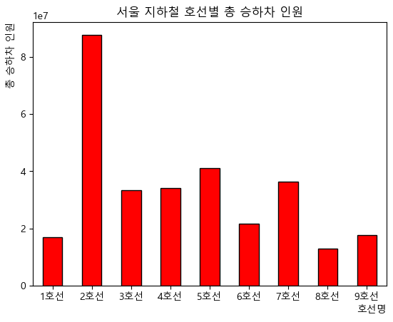
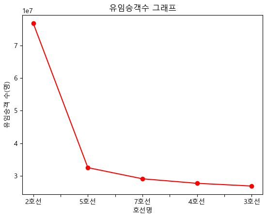
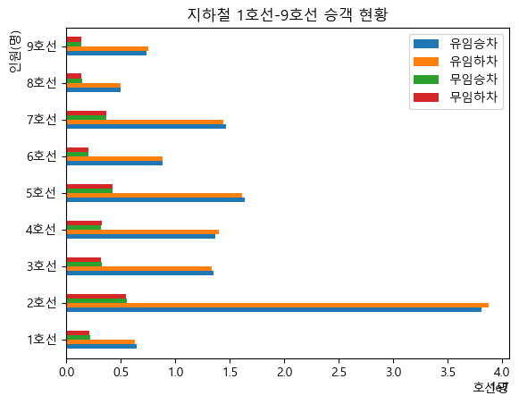
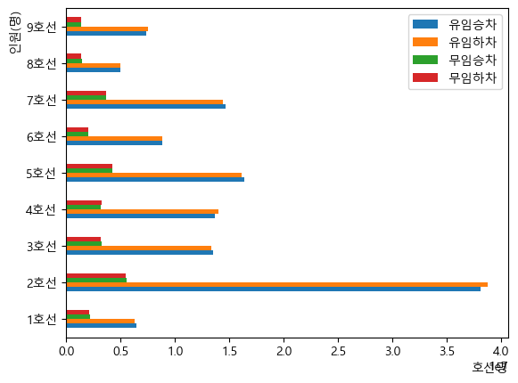

# **20260705-일요실습1**

### 시작 - 


```python
import matplotlib.pyplot as plt       # 맷플롯리브 시각화
import pandas as pd                   # 판다스 데이터분석
import numpy as np                    # 넘파이 수학계산
```

### 다시한번 서울지하철 - **seoul_traffic_202605.xlsx** (여기부터 이어서 시작)


```python
df_line=pd.read_excel('seoul_traffic_202605.xlsx', sheet_name='subway_line_station')
df_line
```


<div>
<style scoped>
    .dataframe tbody tr th:only-of-type {
        vertical-align: middle;
    }

    .dataframe tbody tr th {
        vertical-align: top;
    }

    .dataframe thead th {
        text-align: right;
    }
</style>
<table border="1" class="dataframe">
  <thead>
    <tr style="text-align: right;">
      <th></th>
      <th>사용월</th>
      <th>호선명</th>
      <th>역ID</th>
      <th>지하철역</th>
      <th>승차승객수</th>
      <th>하차승객수</th>
    </tr>
  </thead>
  <tbody>
    <tr>
      <th>0</th>
      <td>2026-05</td>
      <td>1호선</td>
      <td>150</td>
      <td>서울역</td>
      <td>2449533</td>
      <td>2405533</td>
    </tr>
    <tr>
      <th>1</th>
      <td>2026-05</td>
      <td>1호선</td>
      <td>151</td>
      <td>시청</td>
      <td>783572</td>
      <td>790172</td>
    </tr>
    <tr>
      <th>2</th>
      <td>2026-05</td>
      <td>1호선</td>
      <td>152</td>
      <td>종각</td>
      <td>1202972</td>
      <td>1157214</td>
    </tr>
    <tr>
      <th>3</th>
      <td>2026-05</td>
      <td>1호선</td>
      <td>153</td>
      <td>종로3가</td>
      <td>835118</td>
      <td>745726</td>
    </tr>
    <tr>
      <th>4</th>
      <td>2026-05</td>
      <td>1호선</td>
      <td>154</td>
      <td>종로5가</td>
      <td>747033</td>
      <td>725378</td>
    </tr>
    <tr>
      <th>...</th>
      <td>...</td>
      <td>...</td>
      <td>...</td>
      <td>...</td>
      <td>...</td>
      <td>...</td>
    </tr>
    <tr>
      <th>615</th>
      <td>2026-05</td>
      <td>신림선</td>
      <td>4407</td>
      <td>당곡</td>
      <td>145646</td>
      <td>138721</td>
    </tr>
    <tr>
      <th>616</th>
      <td>2026-05</td>
      <td>신림선</td>
      <td>4408</td>
      <td>신림</td>
      <td>72092</td>
      <td>85438</td>
    </tr>
    <tr>
      <th>617</th>
      <td>2026-05</td>
      <td>신림선</td>
      <td>4409</td>
      <td>서원</td>
      <td>108743</td>
      <td>96180</td>
    </tr>
    <tr>
      <th>618</th>
      <td>2026-05</td>
      <td>신림선</td>
      <td>4410</td>
      <td>서울대벤처타운</td>
      <td>309687</td>
      <td>283165</td>
    </tr>
    <tr>
      <th>619</th>
      <td>2026-05</td>
      <td>신림선</td>
      <td>4411</td>
      <td>관악산(서울대)</td>
      <td>119147</td>
      <td>117143</td>
    </tr>
  </tbody>
</table>
<p>620 rows × 6 columns</p>
</div>


```python
df_line=pd.read_excel('seoul_traffic_202605.xlsx', sheet_name='subway_line_station')
df_line=df_line[['사용월','호선명','역ID','지하철역','승차승객수','하차승객수']]         
df_line                                                                                #질문을 하니 교수님께서 직접 오셔서 ddf_line 새 정의를 해주셨다.
```


<div>
<style scoped>
    .dataframe tbody tr th:only-of-type {
        vertical-align: middle;
    }

    .dataframe tbody tr th {
        vertical-align: top;
    }

    .dataframe thead th {
        text-align: right;
    }
</style>
<table border="1" class="dataframe">
  <thead>
    <tr style="text-align: right;">
      <th></th>
      <th>사용월</th>
      <th>호선명</th>
      <th>역ID</th>
      <th>지하철역</th>
      <th>승차승객수</th>
      <th>하차승객수</th>
    </tr>
  </thead>
  <tbody>
    <tr>
      <th>0</th>
      <td>2026-05</td>
      <td>1호선</td>
      <td>150</td>
      <td>서울역</td>
      <td>2449533</td>
      <td>2405533</td>
    </tr>
    <tr>
      <th>1</th>
      <td>2026-05</td>
      <td>1호선</td>
      <td>151</td>
      <td>시청</td>
      <td>783572</td>
      <td>790172</td>
    </tr>
    <tr>
      <th>2</th>
      <td>2026-05</td>
      <td>1호선</td>
      <td>152</td>
      <td>종각</td>
      <td>1202972</td>
      <td>1157214</td>
    </tr>
    <tr>
      <th>3</th>
      <td>2026-05</td>
      <td>1호선</td>
      <td>153</td>
      <td>종로3가</td>
      <td>835118</td>
      <td>745726</td>
    </tr>
    <tr>
      <th>4</th>
      <td>2026-05</td>
      <td>1호선</td>
      <td>154</td>
      <td>종로5가</td>
      <td>747033</td>
      <td>725378</td>
    </tr>
    <tr>
      <th>...</th>
      <td>...</td>
      <td>...</td>
      <td>...</td>
      <td>...</td>
      <td>...</td>
      <td>...</td>
    </tr>
    <tr>
      <th>615</th>
      <td>2026-05</td>
      <td>신림선</td>
      <td>4407</td>
      <td>당곡</td>
      <td>145646</td>
      <td>138721</td>
    </tr>
    <tr>
      <th>616</th>
      <td>2026-05</td>
      <td>신림선</td>
      <td>4408</td>
      <td>신림</td>
      <td>72092</td>
      <td>85438</td>
    </tr>
    <tr>
      <th>617</th>
      <td>2026-05</td>
      <td>신림선</td>
      <td>4409</td>
      <td>서원</td>
      <td>108743</td>
      <td>96180</td>
    </tr>
    <tr>
      <th>618</th>
      <td>2026-05</td>
      <td>신림선</td>
      <td>4410</td>
      <td>서울대벤처타운</td>
      <td>309687</td>
      <td>283165</td>
    </tr>
    <tr>
      <th>619</th>
      <td>2026-05</td>
      <td>신림선</td>
      <td>4411</td>
      <td>관악산(서울대)</td>
      <td>119147</td>
      <td>117143</td>
    </tr>
  </tbody>
</table>
<p>620 rows × 6 columns</p>
</div>


```python
df_line['총승하차승객수']=df_line['승차승객수']+df_line['하차승객수']              #df_line 에 없는걸 선언한건 만들겠다는 뜻
df_line                                                                           # 이제 출력한다.
```


<div>
<style scoped>
    .dataframe tbody tr th:only-of-type {
        vertical-align: middle;
    }

    .dataframe tbody tr th {
        vertical-align: top;
    }

    .dataframe thead th {
        text-align: right;
    }
</style>
<table border="1" class="dataframe">
  <thead>
    <tr style="text-align: right;">
      <th></th>
      <th>사용월</th>
      <th>호선명</th>
      <th>역ID</th>
      <th>지하철역</th>
      <th>승차승객수</th>
      <th>하차승객수</th>
      <th>총승하차승객수</th>
    </tr>
  </thead>
  <tbody>
    <tr>
      <th>0</th>
      <td>2026-05</td>
      <td>1호선</td>
      <td>150</td>
      <td>서울역</td>
      <td>2449533</td>
      <td>2405533</td>
      <td>4855066</td>
    </tr>
    <tr>
      <th>1</th>
      <td>2026-05</td>
      <td>1호선</td>
      <td>151</td>
      <td>시청</td>
      <td>783572</td>
      <td>790172</td>
      <td>1573744</td>
    </tr>
    <tr>
      <th>2</th>
      <td>2026-05</td>
      <td>1호선</td>
      <td>152</td>
      <td>종각</td>
      <td>1202972</td>
      <td>1157214</td>
      <td>2360186</td>
    </tr>
    <tr>
      <th>3</th>
      <td>2026-05</td>
      <td>1호선</td>
      <td>153</td>
      <td>종로3가</td>
      <td>835118</td>
      <td>745726</td>
      <td>1580844</td>
    </tr>
    <tr>
      <th>4</th>
      <td>2026-05</td>
      <td>1호선</td>
      <td>154</td>
      <td>종로5가</td>
      <td>747033</td>
      <td>725378</td>
      <td>1472411</td>
    </tr>
    <tr>
      <th>...</th>
      <td>...</td>
      <td>...</td>
      <td>...</td>
      <td>...</td>
      <td>...</td>
      <td>...</td>
      <td>...</td>
    </tr>
    <tr>
      <th>615</th>
      <td>2026-05</td>
      <td>신림선</td>
      <td>4407</td>
      <td>당곡</td>
      <td>145646</td>
      <td>138721</td>
      <td>284367</td>
    </tr>
    <tr>
      <th>616</th>
      <td>2026-05</td>
      <td>신림선</td>
      <td>4408</td>
      <td>신림</td>
      <td>72092</td>
      <td>85438</td>
      <td>157530</td>
    </tr>
    <tr>
      <th>617</th>
      <td>2026-05</td>
      <td>신림선</td>
      <td>4409</td>
      <td>서원</td>
      <td>108743</td>
      <td>96180</td>
      <td>204923</td>
    </tr>
    <tr>
      <th>618</th>
      <td>2026-05</td>
      <td>신림선</td>
      <td>4410</td>
      <td>서울대벤처타운</td>
      <td>309687</td>
      <td>283165</td>
      <td>592852</td>
    </tr>
    <tr>
      <th>619</th>
      <td>2026-05</td>
      <td>신림선</td>
      <td>4411</td>
      <td>관악산(서울대)</td>
      <td>119147</td>
      <td>117143</td>
      <td>236290</td>
    </tr>
  </tbody>
</table>
<p>620 rows × 7 columns</p>
</div>


#### 총승하차승객수를 호선명을 기준으로 그룹바이


```python
df_line[['호선명','총승하차승객수']].groupby('호선명').sum().head(9)
```


<div>
<style scoped>
    .dataframe tbody tr th:only-of-type {
        vertical-align: middle;
    }

    .dataframe tbody tr th {
        vertical-align: top;
    }

    .dataframe thead th {
        text-align: right;
    }
</style>
<table border="1" class="dataframe">
  <thead>
    <tr style="text-align: right;">
      <th></th>
      <th>총승하차승객수</th>
    </tr>
    <tr>
      <th>호선명</th>
      <th></th>
    </tr>
  </thead>
  <tbody>
    <tr>
      <th>1호선</th>
      <td>16977364</td>
    </tr>
    <tr>
      <th>2호선</th>
      <td>87787733</td>
    </tr>
    <tr>
      <th>3호선</th>
      <td>33326606</td>
    </tr>
    <tr>
      <th>4호선</th>
      <td>34133290</td>
    </tr>
    <tr>
      <th>5호선</th>
      <td>40983496</td>
    </tr>
    <tr>
      <th>6호선</th>
      <td>21733007</td>
    </tr>
    <tr>
      <th>7호선</th>
      <td>36409565</td>
    </tr>
    <tr>
      <th>8호선</th>
      <td>12825792</td>
    </tr>
    <tr>
      <th>9호선</th>
      <td>17664094</td>
    </tr>
  </tbody>
</table>
</div>


```python
df_line[['호선명','총승하차승객수']].groupby('호선명').sum().head(9).plot(kind='bar', color='r', edgecolor='k', rot=0, legend=False)

plt.rc('font', family='Malgun Gothic')  
plt.title('서울 지하철 호선별 총 승하차 인원')
plt.xlabel('호선명', loc='right')
plt.ylabel('총 승하차 인원', loc='top')
plt.show()
```


    

    


#### 유임승객수를 호선명을 기준으로 그룹바이


```python
import matplotlib.pyplot as plt
import pandas as pd
import numpy as np

sub_pay=pd.read_excel('seoul_traffic_202605.xlsx', sheet_name='subway_pay')
sub_pay.head()
```


<div>
<style scoped>
    .dataframe tbody tr th:only-of-type {
        vertical-align: middle;
    }

    .dataframe tbody tr th {
        vertical-align: top;
    }

    .dataframe thead th {
        text-align: right;
    }
</style>
<table border="1" class="dataframe">
  <thead>
    <tr style="text-align: right;">
      <th></th>
      <th>사용월</th>
      <th>호선명</th>
      <th>역ID</th>
      <th>지하철역</th>
      <th>유임승차</th>
      <th>유임하차</th>
      <th>무임승차</th>
      <th>무임하차</th>
    </tr>
  </thead>
  <tbody>
    <tr>
      <th>0</th>
      <td>2026-05</td>
      <td>1호선</td>
      <td>150</td>
      <td>서울역</td>
      <td>2158192</td>
      <td>2121832</td>
      <td>291341</td>
      <td>283701</td>
    </tr>
    <tr>
      <th>1</th>
      <td>2026-05</td>
      <td>1호선</td>
      <td>151</td>
      <td>시청</td>
      <td>679493</td>
      <td>687420</td>
      <td>104079</td>
      <td>102752</td>
    </tr>
    <tr>
      <th>2</th>
      <td>2026-05</td>
      <td>1호선</td>
      <td>152</td>
      <td>종각</td>
      <td>1031847</td>
      <td>997991</td>
      <td>171125</td>
      <td>159223</td>
    </tr>
    <tr>
      <th>3</th>
      <td>2026-05</td>
      <td>1호선</td>
      <td>153</td>
      <td>종로3가</td>
      <td>536436</td>
      <td>474041</td>
      <td>298682</td>
      <td>271685</td>
    </tr>
    <tr>
      <th>4</th>
      <td>2026-05</td>
      <td>1호선</td>
      <td>154</td>
      <td>종로5가</td>
      <td>488431</td>
      <td>474081</td>
      <td>258602</td>
      <td>251297</td>
    </tr>
  </tbody>
</table>
</div>


```python
sub_pay['유임승객수']=sub_pay['유임승차']+sub_pay['유임하차']
sub_pay
```


<div>
<style scoped>
    .dataframe tbody tr th:only-of-type {
        vertical-align: middle;
    }

    .dataframe tbody tr th {
        vertical-align: top;
    }

    .dataframe thead th {
        text-align: right;
    }
</style>
<table border="1" class="dataframe">
  <thead>
    <tr style="text-align: right;">
      <th></th>
      <th>사용월</th>
      <th>호선명</th>
      <th>역ID</th>
      <th>지하철역</th>
      <th>유임승차</th>
      <th>유임하차</th>
      <th>무임승차</th>
      <th>무임하차</th>
      <th>유임승객수</th>
    </tr>
  </thead>
  <tbody>
    <tr>
      <th>0</th>
      <td>2026-05</td>
      <td>1호선</td>
      <td>150</td>
      <td>서울역</td>
      <td>2158192</td>
      <td>2121832</td>
      <td>291341</td>
      <td>283701</td>
      <td>4280024</td>
    </tr>
    <tr>
      <th>1</th>
      <td>2026-05</td>
      <td>1호선</td>
      <td>151</td>
      <td>시청</td>
      <td>679493</td>
      <td>687420</td>
      <td>104079</td>
      <td>102752</td>
      <td>1366913</td>
    </tr>
    <tr>
      <th>2</th>
      <td>2026-05</td>
      <td>1호선</td>
      <td>152</td>
      <td>종각</td>
      <td>1031847</td>
      <td>997991</td>
      <td>171125</td>
      <td>159223</td>
      <td>2029838</td>
    </tr>
    <tr>
      <th>3</th>
      <td>2026-05</td>
      <td>1호선</td>
      <td>153</td>
      <td>종로3가</td>
      <td>536436</td>
      <td>474041</td>
      <td>298682</td>
      <td>271685</td>
      <td>1010477</td>
    </tr>
    <tr>
      <th>4</th>
      <td>2026-05</td>
      <td>1호선</td>
      <td>154</td>
      <td>종로5가</td>
      <td>488431</td>
      <td>474081</td>
      <td>258602</td>
      <td>251297</td>
      <td>962512</td>
    </tr>
    <tr>
      <th>...</th>
      <td>...</td>
      <td>...</td>
      <td>...</td>
      <td>...</td>
      <td>...</td>
      <td>...</td>
      <td>...</td>
      <td>...</td>
      <td>...</td>
    </tr>
    <tr>
      <th>615</th>
      <td>2026-05</td>
      <td>신림선</td>
      <td>4407</td>
      <td>당곡</td>
      <td>99752</td>
      <td>93933</td>
      <td>45894</td>
      <td>44788</td>
      <td>193685</td>
    </tr>
    <tr>
      <th>616</th>
      <td>2026-05</td>
      <td>신림선</td>
      <td>4408</td>
      <td>신림</td>
      <td>48402</td>
      <td>58913</td>
      <td>23690</td>
      <td>26525</td>
      <td>107315</td>
    </tr>
    <tr>
      <th>617</th>
      <td>2026-05</td>
      <td>신림선</td>
      <td>4409</td>
      <td>서원</td>
      <td>77700</td>
      <td>66014</td>
      <td>31043</td>
      <td>30166</td>
      <td>143714</td>
    </tr>
    <tr>
      <th>618</th>
      <td>2026-05</td>
      <td>신림선</td>
      <td>4410</td>
      <td>서울대벤처타운</td>
      <td>230915</td>
      <td>204782</td>
      <td>78772</td>
      <td>78383</td>
      <td>435697</td>
    </tr>
    <tr>
      <th>619</th>
      <td>2026-05</td>
      <td>신림선</td>
      <td>4411</td>
      <td>관악산(서울대)</td>
      <td>70962</td>
      <td>68958</td>
      <td>48185</td>
      <td>48185</td>
      <td>139920</td>
    </tr>
  </tbody>
</table>
<p>620 rows × 9 columns</p>
</div>


```python
# sub_pay_sort 라는 새 변수 만들어서 다른 변수에 저장된 데이터프렘 데이터가 그래프화 되는 문제를 해결했다!
```


```python
sub_pay_sort=sub_pay[['호선명','유임승객수']].groupby('호선명').sum().sort_values(by='유임승객수', ascending=False).head(5)
sub_pay_sort
```


<div>
<style scoped>
    .dataframe tbody tr th:only-of-type {
        vertical-align: middle;
    }

    .dataframe tbody tr th {
        vertical-align: top;
    }

    .dataframe thead th {
        text-align: right;
    }
</style>
<table border="1" class="dataframe">
  <thead>
    <tr style="text-align: right;">
      <th></th>
      <th>유임승객수</th>
    </tr>
    <tr>
      <th>호선명</th>
      <th></th>
    </tr>
  </thead>
  <tbody>
    <tr>
      <th>2호선</th>
      <td>76811863</td>
    </tr>
    <tr>
      <th>5호선</th>
      <td>32496535</td>
    </tr>
    <tr>
      <th>7호선</th>
      <td>29074731</td>
    </tr>
    <tr>
      <th>4호선</th>
      <td>27686611</td>
    </tr>
    <tr>
      <th>3호선</th>
      <td>26854631</td>
    </tr>
  </tbody>
</table>
</div>


```python
sub_pay_sort.plot(kind='line', marker='o', color='r', legend=False)

plt.rc('font', family='Malgun Gothic')
plt.title('유임승객수 그래프')
plt.xlabel('호선명')
plt.ylabel('유임승객 수(명)')
plt.show()
```


    

    


#### 호선명을 기준으로 유임승차, 유임하차, 무임승차, 무임하차를 그룹바이


```python
sub_pay_graph=sub_pay[['호선명','유임승차','유임하차','무임승차','무임하차']].groupby(by='호선명').sum().head(9)
sub_pay_graph
```


<div>
<style scoped>
    .dataframe tbody tr th:only-of-type {
        vertical-align: middle;
    }

    .dataframe tbody tr th {
        vertical-align: top;
    }

    .dataframe thead th {
        text-align: right;
    }
</style>
<table border="1" class="dataframe">
  <thead>
    <tr style="text-align: right;">
      <th></th>
      <th>유임승차</th>
      <th>유임하차</th>
      <th>무임승차</th>
      <th>무임하차</th>
    </tr>
    <tr>
      <th>호선명</th>
      <th></th>
      <th></th>
      <th></th>
      <th></th>
    </tr>
  </thead>
  <tbody>
    <tr>
      <th>1호선</th>
      <td>6419075</td>
      <td>6270702</td>
      <td>2159937</td>
      <td>2127650</td>
    </tr>
    <tr>
      <th>2호선</th>
      <td>38115487</td>
      <td>38696376</td>
      <td>5520166</td>
      <td>5455704</td>
    </tr>
    <tr>
      <th>3호선</th>
      <td>13490732</td>
      <td>13363899</td>
      <td>3268277</td>
      <td>3203698</td>
    </tr>
    <tr>
      <th>4호선</th>
      <td>13684728</td>
      <td>14001883</td>
      <td>3212014</td>
      <td>3234665</td>
    </tr>
    <tr>
      <th>5호선</th>
      <td>16337913</td>
      <td>16158622</td>
      <td>4277487</td>
      <td>4209474</td>
    </tr>
    <tr>
      <th>6호선</th>
      <td>8834967</td>
      <td>8837115</td>
      <td>2046010</td>
      <td>2014915</td>
    </tr>
    <tr>
      <th>7호선</th>
      <td>14658705</td>
      <td>14416026</td>
      <td>3686763</td>
      <td>3648071</td>
    </tr>
    <tr>
      <th>8호선</th>
      <td>4946249</td>
      <td>5016754</td>
      <td>1446371</td>
      <td>1416418</td>
    </tr>
    <tr>
      <th>9호선</th>
      <td>7357970</td>
      <td>7500446</td>
      <td>1404420</td>
      <td>1401258</td>
    </tr>
  </tbody>
</table>
</div>


```python
sub_pay_graph.plot(kind='barh', rot=0)   # bar는 익히 아는 그 세로의 바, bar'h'는 수평 막대

plt.title('지하철 1호선-9호선 승객 현황')
plt.xlabel('호선명', loc='right')
plt.ylabel('인원(명)', loc='top')
plt.show()
```


    

    


```python
# 여기 아래부터는... 음...
```


```python
sub_pay_graph_init_okay=sub_pay_graph2_init=sub_pay[['경인선','경의선','경원선','경부선','경강선']]
sub_pay_graph_init_okay

# 난 무얼 하려고 했던것인가...
```


    ---------------------------------------------------------------------------

    KeyError                                  Traceback (most recent call last)

    Cell In[74], line 1
    ----> 1 sub_pay_graph_init_okay=sub_pay_graph2_init=sub_pay[['경인선','경의선','경원선','경부선','경강선']]
          2 sub_pay_graph_init_okay
    

    File C:\ProgramData\anaconda3\Lib\site-packages\pandas\core\frame.py:4108, in DataFrame.__getitem__(self, key)
       4106     if is_iterator(key):
       4107         key = list(key)
    -> 4108     indexer = self.columns._get_indexer_strict(key, "columns")[1]
       4110 # take() does not accept boolean indexers
       4111 if getattr(indexer, "dtype", None) == bool:
    

    File C:\ProgramData\anaconda3\Lib\site-packages\pandas\core\indexes\base.py:6200, in Index._get_indexer_strict(self, key, axis_name)
       6197 else:
       6198     keyarr, indexer, new_indexer = self._reindex_non_unique(keyarr)
    -> 6200 self._raise_if_missing(keyarr, indexer, axis_name)
       6202 keyarr = self.take(indexer)
       6203 if isinstance(key, Index):
       6204     # GH 42790 - Preserve name from an Index
    

    File C:\ProgramData\anaconda3\Lib\site-packages\pandas\core\indexes\base.py:6249, in Index._raise_if_missing(self, key, indexer, axis_name)
       6247 if nmissing:
       6248     if nmissing == len(indexer):
    -> 6249         raise KeyError(f"None of [{key}] are in the [{axis_name}]")
       6251     not_found = list(ensure_index(key)[missing_mask.nonzero()[0]].unique())
       6252     raise KeyError(f"{not_found} not in index")
    

    KeyError: "None of [Index(['경인선', '경의선', '경원선', '경부선', '경강선'], dtype='object')] are in the [columns]"


```python
sub_pay_graph2=sub_pay[['호선명','유임승차','유임하차','무임승차','무임하차']].groupby(by='호선명').sum().head(9)
sub_pay_graph2
```


<div>
<style scoped>
    .dataframe tbody tr th:only-of-type {
        vertical-align: middle;
    }

    .dataframe tbody tr th {
        vertical-align: top;
    }

    .dataframe thead th {
        text-align: right;
    }
</style>
<table border="1" class="dataframe">
  <thead>
    <tr style="text-align: right;">
      <th></th>
      <th>유임승차</th>
      <th>유임하차</th>
      <th>무임승차</th>
      <th>무임하차</th>
    </tr>
    <tr>
      <th>호선명</th>
      <th></th>
      <th></th>
      <th></th>
      <th></th>
    </tr>
  </thead>
  <tbody>
    <tr>
      <th>1호선</th>
      <td>6419075</td>
      <td>6270702</td>
      <td>2159937</td>
      <td>2127650</td>
    </tr>
    <tr>
      <th>2호선</th>
      <td>38115487</td>
      <td>38696376</td>
      <td>5520166</td>
      <td>5455704</td>
    </tr>
    <tr>
      <th>3호선</th>
      <td>13490732</td>
      <td>13363899</td>
      <td>3268277</td>
      <td>3203698</td>
    </tr>
    <tr>
      <th>4호선</th>
      <td>13684728</td>
      <td>14001883</td>
      <td>3212014</td>
      <td>3234665</td>
    </tr>
    <tr>
      <th>5호선</th>
      <td>16337913</td>
      <td>16158622</td>
      <td>4277487</td>
      <td>4209474</td>
    </tr>
    <tr>
      <th>6호선</th>
      <td>8834967</td>
      <td>8837115</td>
      <td>2046010</td>
      <td>2014915</td>
    </tr>
    <tr>
      <th>7호선</th>
      <td>14658705</td>
      <td>14416026</td>
      <td>3686763</td>
      <td>3648071</td>
    </tr>
    <tr>
      <th>8호선</th>
      <td>4946249</td>
      <td>5016754</td>
      <td>1446371</td>
      <td>1416418</td>
    </tr>
    <tr>
      <th>9호선</th>
      <td>7357970</td>
      <td>7500446</td>
      <td>1404420</td>
      <td>1401258</td>
    </tr>
  </tbody>
</table>
</div>


```python
sub_pay_graph.plot(kind='barh', rot=0)   # bar는 익히 아는 그 세로의 바, bar'h'는 수평 막대

plt.xlabel('호선명', loc='right')
plt.ylabel('인원(명)', loc='top')
plt.show()
```


    

    


```python

```
