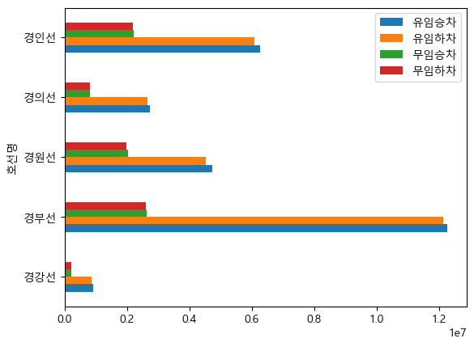
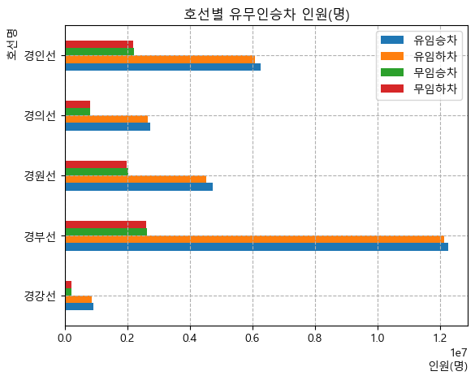
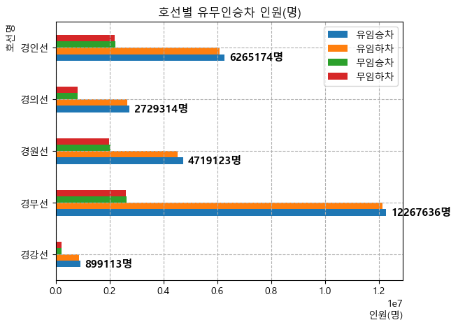

# **20260705-일요실습1**

### 시작 - 


```python
import matplotlib.pyplot as plt       # 맷플롯리브 시각화
import pandas as pd                   # 판다스 데이터분석
import numpy as np                    # 넘파이 수학계산
```

### 다시한번 서울지하철 - **seoul_traffic_202605.xlsx** (여기부터 이어서 시작)


```python
df_line=pd.read_excel('seoul_traffic_202605.xlsx', sheet_name='subway_line_station')
df_line
```


<div>
<style scoped>
    .dataframe tbody tr th:only-of-type {
        vertical-align: middle;
    }

    .dataframe tbody tr th {
        vertical-align: top;
    }

    .dataframe thead th {
        text-align: right;
    }
</style>
<table border="1" class="dataframe">
  <thead>
    <tr style="text-align: right;">
      <th></th>
      <th>사용월</th>
      <th>호선명</th>
      <th>역ID</th>
      <th>지하철역</th>
      <th>승차승객수</th>
      <th>하차승객수</th>
    </tr>
  </thead>
  <tbody>
    <tr>
      <th>0</th>
      <td>2026-05</td>
      <td>1호선</td>
      <td>150</td>
      <td>서울역</td>
      <td>2449533</td>
      <td>2405533</td>
    </tr>
    <tr>
      <th>1</th>
      <td>2026-05</td>
      <td>1호선</td>
      <td>151</td>
      <td>시청</td>
      <td>783572</td>
      <td>790172</td>
    </tr>
    <tr>
      <th>2</th>
      <td>2026-05</td>
      <td>1호선</td>
      <td>152</td>
      <td>종각</td>
      <td>1202972</td>
      <td>1157214</td>
    </tr>
    <tr>
      <th>3</th>
      <td>2026-05</td>
      <td>1호선</td>
      <td>153</td>
      <td>종로3가</td>
      <td>835118</td>
      <td>745726</td>
    </tr>
    <tr>
      <th>4</th>
      <td>2026-05</td>
      <td>1호선</td>
      <td>154</td>
      <td>종로5가</td>
      <td>747033</td>
      <td>725378</td>
    </tr>
    <tr>
      <th>...</th>
      <td>...</td>
      <td>...</td>
      <td>...</td>
      <td>...</td>
      <td>...</td>
      <td>...</td>
    </tr>
    <tr>
      <th>615</th>
      <td>2026-05</td>
      <td>신림선</td>
      <td>4407</td>
      <td>당곡</td>
      <td>145646</td>
      <td>138721</td>
    </tr>
    <tr>
      <th>616</th>
      <td>2026-05</td>
      <td>신림선</td>
      <td>4408</td>
      <td>신림</td>
      <td>72092</td>
      <td>85438</td>
    </tr>
    <tr>
      <th>617</th>
      <td>2026-05</td>
      <td>신림선</td>
      <td>4409</td>
      <td>서원</td>
      <td>108743</td>
      <td>96180</td>
    </tr>
    <tr>
      <th>618</th>
      <td>2026-05</td>
      <td>신림선</td>
      <td>4410</td>
      <td>서울대벤처타운</td>
      <td>309687</td>
      <td>283165</td>
    </tr>
    <tr>
      <th>619</th>
      <td>2026-05</td>
      <td>신림선</td>
      <td>4411</td>
      <td>관악산(서울대)</td>
      <td>119147</td>
      <td>117143</td>
    </tr>
  </tbody>
</table>
<p>620 rows × 6 columns</p>
</div>


```python
df_line=pd.read_excel('seoul_traffic_202605.xlsx', sheet_name='subway_line_station')
df_line=df_line[['사용월','호선명','역ID','지하철역','승차승객수','하차승객수']]         
df_line                                                                                #질문을 하니 교수님께서 직접 오셔서 ddf_line 새 정의를 해주셨다.
```


<div>
<style scoped>
    .dataframe tbody tr th:only-of-type {
        vertical-align: middle;
    }

    .dataframe tbody tr th {
        vertical-align: top;
    }

    .dataframe thead th {
        text-align: right;
    }
</style>
<table border="1" class="dataframe">
  <thead>
    <tr style="text-align: right;">
      <th></th>
      <th>사용월</th>
      <th>호선명</th>
      <th>역ID</th>
      <th>지하철역</th>
      <th>승차승객수</th>
      <th>하차승객수</th>
    </tr>
  </thead>
  <tbody>
    <tr>
      <th>0</th>
      <td>2026-05</td>
      <td>1호선</td>
      <td>150</td>
      <td>서울역</td>
      <td>2449533</td>
      <td>2405533</td>
    </tr>
    <tr>
      <th>1</th>
      <td>2026-05</td>
      <td>1호선</td>
      <td>151</td>
      <td>시청</td>
      <td>783572</td>
      <td>790172</td>
    </tr>
    <tr>
      <th>2</th>
      <td>2026-05</td>
      <td>1호선</td>
      <td>152</td>
      <td>종각</td>
      <td>1202972</td>
      <td>1157214</td>
    </tr>
    <tr>
      <th>3</th>
      <td>2026-05</td>
      <td>1호선</td>
      <td>153</td>
      <td>종로3가</td>
      <td>835118</td>
      <td>745726</td>
    </tr>
    <tr>
      <th>4</th>
      <td>2026-05</td>
      <td>1호선</td>
      <td>154</td>
      <td>종로5가</td>
      <td>747033</td>
      <td>725378</td>
    </tr>
    <tr>
      <th>...</th>
      <td>...</td>
      <td>...</td>
      <td>...</td>
      <td>...</td>
      <td>...</td>
      <td>...</td>
    </tr>
    <tr>
      <th>615</th>
      <td>2026-05</td>
      <td>신림선</td>
      <td>4407</td>
      <td>당곡</td>
      <td>145646</td>
      <td>138721</td>
    </tr>
    <tr>
      <th>616</th>
      <td>2026-05</td>
      <td>신림선</td>
      <td>4408</td>
      <td>신림</td>
      <td>72092</td>
      <td>85438</td>
    </tr>
    <tr>
      <th>617</th>
      <td>2026-05</td>
      <td>신림선</td>
      <td>4409</td>
      <td>서원</td>
      <td>108743</td>
      <td>96180</td>
    </tr>
    <tr>
      <th>618</th>
      <td>2026-05</td>
      <td>신림선</td>
      <td>4410</td>
      <td>서울대벤처타운</td>
      <td>309687</td>
      <td>283165</td>
    </tr>
    <tr>
      <th>619</th>
      <td>2026-05</td>
      <td>신림선</td>
      <td>4411</td>
      <td>관악산(서울대)</td>
      <td>119147</td>
      <td>117143</td>
    </tr>
  </tbody>
</table>
<p>620 rows × 6 columns</p>
</div>


```python
df_line['총승하차승객수']=df_line['승차승객수']+df_line['하차승객수']              #df_line 에 없는걸 선언한건 만들겠다는 뜻
df_line                                                                           # 이제 출력한다.
```


<div>
<style scoped>
    .dataframe tbody tr th:only-of-type {
        vertical-align: middle;
    }

    .dataframe tbody tr th {
        vertical-align: top;
    }

    .dataframe thead th {
        text-align: right;
    }
</style>
<table border="1" class="dataframe">
  <thead>
    <tr style="text-align: right;">
      <th></th>
      <th>사용월</th>
      <th>호선명</th>
      <th>역ID</th>
      <th>지하철역</th>
      <th>승차승객수</th>
      <th>하차승객수</th>
      <th>총승하차승객수</th>
    </tr>
  </thead>
  <tbody>
    <tr>
      <th>0</th>
      <td>2026-05</td>
      <td>1호선</td>
      <td>150</td>
      <td>서울역</td>
      <td>2449533</td>
      <td>2405533</td>
      <td>4855066</td>
    </tr>
    <tr>
      <th>1</th>
      <td>2026-05</td>
      <td>1호선</td>
      <td>151</td>
      <td>시청</td>
      <td>783572</td>
      <td>790172</td>
      <td>1573744</td>
    </tr>
    <tr>
      <th>2</th>
      <td>2026-05</td>
      <td>1호선</td>
      <td>152</td>
      <td>종각</td>
      <td>1202972</td>
      <td>1157214</td>
      <td>2360186</td>
    </tr>
    <tr>
      <th>3</th>
      <td>2026-05</td>
      <td>1호선</td>
      <td>153</td>
      <td>종로3가</td>
      <td>835118</td>
      <td>745726</td>
      <td>1580844</td>
    </tr>
    <tr>
      <th>4</th>
      <td>2026-05</td>
      <td>1호선</td>
      <td>154</td>
      <td>종로5가</td>
      <td>747033</td>
      <td>725378</td>
      <td>1472411</td>
    </tr>
    <tr>
      <th>...</th>
      <td>...</td>
      <td>...</td>
      <td>...</td>
      <td>...</td>
      <td>...</td>
      <td>...</td>
      <td>...</td>
    </tr>
    <tr>
      <th>615</th>
      <td>2026-05</td>
      <td>신림선</td>
      <td>4407</td>
      <td>당곡</td>
      <td>145646</td>
      <td>138721</td>
      <td>284367</td>
    </tr>
    <tr>
      <th>616</th>
      <td>2026-05</td>
      <td>신림선</td>
      <td>4408</td>
      <td>신림</td>
      <td>72092</td>
      <td>85438</td>
      <td>157530</td>
    </tr>
    <tr>
      <th>617</th>
      <td>2026-05</td>
      <td>신림선</td>
      <td>4409</td>
      <td>서원</td>
      <td>108743</td>
      <td>96180</td>
      <td>204923</td>
    </tr>
    <tr>
      <th>618</th>
      <td>2026-05</td>
      <td>신림선</td>
      <td>4410</td>
      <td>서울대벤처타운</td>
      <td>309687</td>
      <td>283165</td>
      <td>592852</td>
    </tr>
    <tr>
      <th>619</th>
      <td>2026-05</td>
      <td>신림선</td>
      <td>4411</td>
      <td>관악산(서울대)</td>
      <td>119147</td>
      <td>117143</td>
      <td>236290</td>
    </tr>
  </tbody>
</table>
<p>620 rows × 7 columns</p>
</div>


#### 총승하차승객수를 호선명을 기준으로 그룹바이


```python
df_line[['호선명','총승하차승객수']].groupby('호선명').sum().head(9)
```


<div>
<style scoped>
    .dataframe tbody tr th:only-of-type {
        vertical-align: middle;
    }

    .dataframe tbody tr th {
        vertical-align: top;
    }

    .dataframe thead th {
        text-align: right;
    }
</style>
<table border="1" class="dataframe">
  <thead>
    <tr style="text-align: right;">
      <th></th>
      <th>총승하차승객수</th>
    </tr>
    <tr>
      <th>호선명</th>
      <th></th>
    </tr>
  </thead>
  <tbody>
    <tr>
      <th>1호선</th>
      <td>16977364</td>
    </tr>
    <tr>
      <th>2호선</th>
      <td>87787733</td>
    </tr>
    <tr>
      <th>3호선</th>
      <td>33326606</td>
    </tr>
    <tr>
      <th>4호선</th>
      <td>34133290</td>
    </tr>
    <tr>
      <th>5호선</th>
      <td>40983496</td>
    </tr>
    <tr>
      <th>6호선</th>
      <td>21733007</td>
    </tr>
    <tr>
      <th>7호선</th>
      <td>36409565</td>
    </tr>
    <tr>
      <th>8호선</th>
      <td>12825792</td>
    </tr>
    <tr>
      <th>9호선</th>
      <td>17664094</td>
    </tr>
  </tbody>
</table>
</div>


```python
df_line[['호선명','총승하차승객수']].groupby('호선명').sum().head(9).plot(kind='bar', color='r', edgecolor='k', rot=0, legend=False)

plt.rc('font', family='Malgun Gothic')  
plt.title('서울 지하철 호선별 총 승하차 인원')
plt.xlabel('호선명', loc='right')
plt.ylabel('총 승하차 인원', loc='top')
plt.show()
```


    

    


#### 유임승객수를 호선명을 기준으로 그룹바이


```python
import matplotlib.pyplot as plt
import pandas as pd
import numpy as np

sub_pay=pd.read_excel('seoul_traffic_202605.xlsx', sheet_name='subway_pay')
sub_pay.head()
```


<div>
<style scoped>
    .dataframe tbody tr th:only-of-type {
        vertical-align: middle;
    }

    .dataframe tbody tr th {
        vertical-align: top;
    }

    .dataframe thead th {
        text-align: right;
    }
</style>
<table border="1" class="dataframe">
  <thead>
    <tr style="text-align: right;">
      <th></th>
      <th>사용월</th>
      <th>호선명</th>
      <th>역ID</th>
      <th>지하철역</th>
      <th>유임승차</th>
      <th>유임하차</th>
      <th>무임승차</th>
      <th>무임하차</th>
    </tr>
  </thead>
  <tbody>
    <tr>
      <th>0</th>
      <td>2026-05</td>
      <td>1호선</td>
      <td>150</td>
      <td>서울역</td>
      <td>2158192</td>
      <td>2121832</td>
      <td>291341</td>
      <td>283701</td>
    </tr>
    <tr>
      <th>1</th>
      <td>2026-05</td>
      <td>1호선</td>
      <td>151</td>
      <td>시청</td>
      <td>679493</td>
      <td>687420</td>
      <td>104079</td>
      <td>102752</td>
    </tr>
    <tr>
      <th>2</th>
      <td>2026-05</td>
      <td>1호선</td>
      <td>152</td>
      <td>종각</td>
      <td>1031847</td>
      <td>997991</td>
      <td>171125</td>
      <td>159223</td>
    </tr>
    <tr>
      <th>3</th>
      <td>2026-05</td>
      <td>1호선</td>
      <td>153</td>
      <td>종로3가</td>
      <td>536436</td>
      <td>474041</td>
      <td>298682</td>
      <td>271685</td>
    </tr>
    <tr>
      <th>4</th>
      <td>2026-05</td>
      <td>1호선</td>
      <td>154</td>
      <td>종로5가</td>
      <td>488431</td>
      <td>474081</td>
      <td>258602</td>
      <td>251297</td>
    </tr>
  </tbody>
</table>
</div>


```python
sub_pay['유임승객수']=sub_pay['유임승차']+sub_pay['유임하차']
sub_pay
```


<div>
<style scoped>
    .dataframe tbody tr th:only-of-type {
        vertical-align: middle;
    }

    .dataframe tbody tr th {
        vertical-align: top;
    }

    .dataframe thead th {
        text-align: right;
    }
</style>
<table border="1" class="dataframe">
  <thead>
    <tr style="text-align: right;">
      <th></th>
      <th>사용월</th>
      <th>호선명</th>
      <th>역ID</th>
      <th>지하철역</th>
      <th>유임승차</th>
      <th>유임하차</th>
      <th>무임승차</th>
      <th>무임하차</th>
      <th>유임승객수</th>
    </tr>
  </thead>
  <tbody>
    <tr>
      <th>0</th>
      <td>2026-05</td>
      <td>1호선</td>
      <td>150</td>
      <td>서울역</td>
      <td>2158192</td>
      <td>2121832</td>
      <td>291341</td>
      <td>283701</td>
      <td>4280024</td>
    </tr>
    <tr>
      <th>1</th>
      <td>2026-05</td>
      <td>1호선</td>
      <td>151</td>
      <td>시청</td>
      <td>679493</td>
      <td>687420</td>
      <td>104079</td>
      <td>102752</td>
      <td>1366913</td>
    </tr>
    <tr>
      <th>2</th>
      <td>2026-05</td>
      <td>1호선</td>
      <td>152</td>
      <td>종각</td>
      <td>1031847</td>
      <td>997991</td>
      <td>171125</td>
      <td>159223</td>
      <td>2029838</td>
    </tr>
    <tr>
      <th>3</th>
      <td>2026-05</td>
      <td>1호선</td>
      <td>153</td>
      <td>종로3가</td>
      <td>536436</td>
      <td>474041</td>
      <td>298682</td>
      <td>271685</td>
      <td>1010477</td>
    </tr>
    <tr>
      <th>4</th>
      <td>2026-05</td>
      <td>1호선</td>
      <td>154</td>
      <td>종로5가</td>
      <td>488431</td>
      <td>474081</td>
      <td>258602</td>
      <td>251297</td>
      <td>962512</td>
    </tr>
    <tr>
      <th>...</th>
      <td>...</td>
      <td>...</td>
      <td>...</td>
      <td>...</td>
      <td>...</td>
      <td>...</td>
      <td>...</td>
      <td>...</td>
      <td>...</td>
    </tr>
    <tr>
      <th>615</th>
      <td>2026-05</td>
      <td>신림선</td>
      <td>4407</td>
      <td>당곡</td>
      <td>99752</td>
      <td>93933</td>
      <td>45894</td>
      <td>44788</td>
      <td>193685</td>
    </tr>
    <tr>
      <th>616</th>
      <td>2026-05</td>
      <td>신림선</td>
      <td>4408</td>
      <td>신림</td>
      <td>48402</td>
      <td>58913</td>
      <td>23690</td>
      <td>26525</td>
      <td>107315</td>
    </tr>
    <tr>
      <th>617</th>
      <td>2026-05</td>
      <td>신림선</td>
      <td>4409</td>
      <td>서원</td>
      <td>77700</td>
      <td>66014</td>
      <td>31043</td>
      <td>30166</td>
      <td>143714</td>
    </tr>
    <tr>
      <th>618</th>
      <td>2026-05</td>
      <td>신림선</td>
      <td>4410</td>
      <td>서울대벤처타운</td>
      <td>230915</td>
      <td>204782</td>
      <td>78772</td>
      <td>78383</td>
      <td>435697</td>
    </tr>
    <tr>
      <th>619</th>
      <td>2026-05</td>
      <td>신림선</td>
      <td>4411</td>
      <td>관악산(서울대)</td>
      <td>70962</td>
      <td>68958</td>
      <td>48185</td>
      <td>48185</td>
      <td>139920</td>
    </tr>
  </tbody>
</table>
<p>620 rows × 9 columns</p>
</div>


```python
# sub_pay_sort 라는 새 변수 만들어서 다른 변수에 저장된 데이터프렘 데이터가 그래프화 되는 문제를 해결했다!
```


```python
sub_pay_sort=sub_pay[['호선명','유임승객수']].groupby('호선명').sum().sort_values(by='유임승객수', ascending=False).head(5)
sub_pay_sort
```


<div>
<style scoped>
    .dataframe tbody tr th:only-of-type {
        vertical-align: middle;
    }

    .dataframe tbody tr th {
        vertical-align: top;
    }

    .dataframe thead th {
        text-align: right;
    }
</style>
<table border="1" class="dataframe">
  <thead>
    <tr style="text-align: right;">
      <th></th>
      <th>유임승객수</th>
    </tr>
    <tr>
      <th>호선명</th>
      <th></th>
    </tr>
  </thead>
  <tbody>
    <tr>
      <th>2호선</th>
      <td>76811863</td>
    </tr>
    <tr>
      <th>5호선</th>
      <td>32496535</td>
    </tr>
    <tr>
      <th>7호선</th>
      <td>29074731</td>
    </tr>
    <tr>
      <th>4호선</th>
      <td>27686611</td>
    </tr>
    <tr>
      <th>3호선</th>
      <td>26854631</td>
    </tr>
  </tbody>
</table>
</div>


```python
sub_pay_sort.plot(kind='line', marker='o', color='r', legend=False)

plt.rc('font', family='Malgun Gothic')
plt.title('유임승객수 그래프')
plt.xlabel('호선명')
plt.ylabel('유임승객 수(명)')
plt.show()
```


    

    


#### 호선명을 기준으로 유임승차, 유임하차, 무임승차, 무임하차를 그룹바이


```python
sub_pay_graph=sub_pay[['호선명','유임승차','유임하차','무임승차','무임하차']].groupby(by='호선명').sum().head(9)
sub_pay_graph
```


<div>
<style scoped>
    .dataframe tbody tr th:only-of-type {
        vertical-align: middle;
    }

    .dataframe tbody tr th {
        vertical-align: top;
    }

    .dataframe thead th {
        text-align: right;
    }
</style>
<table border="1" class="dataframe">
  <thead>
    <tr style="text-align: right;">
      <th></th>
      <th>유임승차</th>
      <th>유임하차</th>
      <th>무임승차</th>
      <th>무임하차</th>
    </tr>
    <tr>
      <th>호선명</th>
      <th></th>
      <th></th>
      <th></th>
      <th></th>
    </tr>
  </thead>
  <tbody>
    <tr>
      <th>1호선</th>
      <td>6419075</td>
      <td>6270702</td>
      <td>2159937</td>
      <td>2127650</td>
    </tr>
    <tr>
      <th>2호선</th>
      <td>38115487</td>
      <td>38696376</td>
      <td>5520166</td>
      <td>5455704</td>
    </tr>
    <tr>
      <th>3호선</th>
      <td>13490732</td>
      <td>13363899</td>
      <td>3268277</td>
      <td>3203698</td>
    </tr>
    <tr>
      <th>4호선</th>
      <td>13684728</td>
      <td>14001883</td>
      <td>3212014</td>
      <td>3234665</td>
    </tr>
    <tr>
      <th>5호선</th>
      <td>16337913</td>
      <td>16158622</td>
      <td>4277487</td>
      <td>4209474</td>
    </tr>
    <tr>
      <th>6호선</th>
      <td>8834967</td>
      <td>8837115</td>
      <td>2046010</td>
      <td>2014915</td>
    </tr>
    <tr>
      <th>7호선</th>
      <td>14658705</td>
      <td>14416026</td>
      <td>3686763</td>
      <td>3648071</td>
    </tr>
    <tr>
      <th>8호선</th>
      <td>4946249</td>
      <td>5016754</td>
      <td>1446371</td>
      <td>1416418</td>
    </tr>
    <tr>
      <th>9호선</th>
      <td>7357970</td>
      <td>7500446</td>
      <td>1404420</td>
      <td>1401258</td>
    </tr>
  </tbody>
</table>
</div>


```python
sub_pay_graph.plot(kind='barh', rot=0)   # bar는 익히 아는 그 세로의 바, bar'h'는 수평 막대

plt.title('지하철 1호선-9호선 승객 현황')
plt.xlabel('호선명', loc='right')
plt.ylabel('인원(명)', loc='top')
plt.show()
```


    

    


```python
# 여기 아래부터는... 음...
```


```python
sub_pay_graph_init_okay=sub_pay_graph2_init=sub_pay[['경인선','경의선','경원선','경부선','경강선']]
sub_pay_graph_init_okay

# 난 무얼 하려고 했던것인가...
```


    ---------------------------------------------------------------------------

    KeyError                                  Traceback (most recent call last)

    Cell In[74], line 1
    ----> 1 sub_pay_graph_init_okay=sub_pay_graph2_init=sub_pay[['경인선','경의선','경원선','경부선','경강선']]
          2 sub_pay_graph_init_okay
    

    File C:\ProgramData\anaconda3\Lib\site-packages\pandas\core\frame.py:4108, in DataFrame.__getitem__(self, key)
       4106     if is_iterator(key):
       4107         key = list(key)
    -> 4108     indexer = self.columns._get_indexer_strict(key, "columns")[1]
       4110 # take() does not accept boolean indexers
       4111 if getattr(indexer, "dtype", None) == bool:
    

    File C:\ProgramData\anaconda3\Lib\site-packages\pandas\core\indexes\base.py:6200, in Index._get_indexer_strict(self, key, axis_name)
       6197 else:
       6198     keyarr, indexer, new_indexer = self._reindex_non_unique(keyarr)
    -> 6200 self._raise_if_missing(keyarr, indexer, axis_name)
       6202 keyarr = self.take(indexer)
       6203 if isinstance(key, Index):
       6204     # GH 42790 - Preserve name from an Index
    

    File C:\ProgramData\anaconda3\Lib\site-packages\pandas\core\indexes\base.py:6249, in Index._raise_if_missing(self, key, indexer, axis_name)
       6247 if nmissing:
       6248     if nmissing == len(indexer):
    -> 6249         raise KeyError(f"None of [{key}] are in the [{axis_name}]")
       6251     not_found = list(ensure_index(key)[missing_mask.nonzero()[0]].unique())
       6252     raise KeyError(f"{not_found} not in index")
    

    KeyError: "None of [Index(['경인선', '경의선', '경원선', '경부선', '경강선'], dtype='object')] are in the [columns]"


```python
sub_pay_graph2=sub_pay[['호선명','유임승차','유임하차','무임승차','무임하차']].groupby(by='호선명').sum().head(9)
sub_pay_graph2
```


<div>
<style scoped>
    .dataframe tbody tr th:only-of-type {
        vertical-align: middle;
    }

    .dataframe tbody tr th {
        vertical-align: top;
    }

    .dataframe thead th {
        text-align: right;
    }
</style>
<table border="1" class="dataframe">
  <thead>
    <tr style="text-align: right;">
      <th></th>
      <th>유임승차</th>
      <th>유임하차</th>
      <th>무임승차</th>
      <th>무임하차</th>
    </tr>
    <tr>
      <th>호선명</th>
      <th></th>
      <th></th>
      <th></th>
      <th></th>
    </tr>
  </thead>
  <tbody>
    <tr>
      <th>1호선</th>
      <td>6419075</td>
      <td>6270702</td>
      <td>2159937</td>
      <td>2127650</td>
    </tr>
    <tr>
      <th>2호선</th>
      <td>38115487</td>
      <td>38696376</td>
      <td>5520166</td>
      <td>5455704</td>
    </tr>
    <tr>
      <th>3호선</th>
      <td>13490732</td>
      <td>13363899</td>
      <td>3268277</td>
      <td>3203698</td>
    </tr>
    <tr>
      <th>4호선</th>
      <td>13684728</td>
      <td>14001883</td>
      <td>3212014</td>
      <td>3234665</td>
    </tr>
    <tr>
      <th>5호선</th>
      <td>16337913</td>
      <td>16158622</td>
      <td>4277487</td>
      <td>4209474</td>
    </tr>
    <tr>
      <th>6호선</th>
      <td>8834967</td>
      <td>8837115</td>
      <td>2046010</td>
      <td>2014915</td>
    </tr>
    <tr>
      <th>7호선</th>
      <td>14658705</td>
      <td>14416026</td>
      <td>3686763</td>
      <td>3648071</td>
    </tr>
    <tr>
      <th>8호선</th>
      <td>4946249</td>
      <td>5016754</td>
      <td>1446371</td>
      <td>1416418</td>
    </tr>
    <tr>
      <th>9호선</th>
      <td>7357970</td>
      <td>7500446</td>
      <td>1404420</td>
      <td>1401258</td>
    </tr>
  </tbody>
</table>
</div>


```python
sub_pay_graph.plot(kind='barh', rot=0)   # bar는 익히 아는 그 세로의 바, bar'h'는 수평 막대

plt.xlabel('호선명', loc='right')
plt.ylabel('인원(명)', loc='top')
plt.show()
```


    

    


```python
# 슬라이싱? 가로로 빼거나 세로로 빼야한다...? 아니면 동시에 해야한다..??
```

#### **이제 교수님과 함께 풀어보기...**


```python
sub_pay
```


<div>
<style scoped>
    .dataframe tbody tr th:only-of-type {
        vertical-align: middle;
    }

    .dataframe tbody tr th {
        vertical-align: top;
    }

    .dataframe thead th {
        text-align: right;
    }
</style>
<table border="1" class="dataframe">
  <thead>
    <tr style="text-align: right;">
      <th></th>
      <th>사용월</th>
      <th>호선명</th>
      <th>역ID</th>
      <th>지하철역</th>
      <th>유임승차</th>
      <th>유임하차</th>
      <th>무임승차</th>
      <th>무임하차</th>
      <th>유임승객수</th>
    </tr>
  </thead>
  <tbody>
    <tr>
      <th>0</th>
      <td>2026-05</td>
      <td>1호선</td>
      <td>150</td>
      <td>서울역</td>
      <td>2158192</td>
      <td>2121832</td>
      <td>291341</td>
      <td>283701</td>
      <td>4280024</td>
    </tr>
    <tr>
      <th>1</th>
      <td>2026-05</td>
      <td>1호선</td>
      <td>151</td>
      <td>시청</td>
      <td>679493</td>
      <td>687420</td>
      <td>104079</td>
      <td>102752</td>
      <td>1366913</td>
    </tr>
    <tr>
      <th>2</th>
      <td>2026-05</td>
      <td>1호선</td>
      <td>152</td>
      <td>종각</td>
      <td>1031847</td>
      <td>997991</td>
      <td>171125</td>
      <td>159223</td>
      <td>2029838</td>
    </tr>
    <tr>
      <th>3</th>
      <td>2026-05</td>
      <td>1호선</td>
      <td>153</td>
      <td>종로3가</td>
      <td>536436</td>
      <td>474041</td>
      <td>298682</td>
      <td>271685</td>
      <td>1010477</td>
    </tr>
    <tr>
      <th>4</th>
      <td>2026-05</td>
      <td>1호선</td>
      <td>154</td>
      <td>종로5가</td>
      <td>488431</td>
      <td>474081</td>
      <td>258602</td>
      <td>251297</td>
      <td>962512</td>
    </tr>
    <tr>
      <th>...</th>
      <td>...</td>
      <td>...</td>
      <td>...</td>
      <td>...</td>
      <td>...</td>
      <td>...</td>
      <td>...</td>
      <td>...</td>
      <td>...</td>
    </tr>
    <tr>
      <th>615</th>
      <td>2026-05</td>
      <td>신림선</td>
      <td>4407</td>
      <td>당곡</td>
      <td>99752</td>
      <td>93933</td>
      <td>45894</td>
      <td>44788</td>
      <td>193685</td>
    </tr>
    <tr>
      <th>616</th>
      <td>2026-05</td>
      <td>신림선</td>
      <td>4408</td>
      <td>신림</td>
      <td>48402</td>
      <td>58913</td>
      <td>23690</td>
      <td>26525</td>
      <td>107315</td>
    </tr>
    <tr>
      <th>617</th>
      <td>2026-05</td>
      <td>신림선</td>
      <td>4409</td>
      <td>서원</td>
      <td>77700</td>
      <td>66014</td>
      <td>31043</td>
      <td>30166</td>
      <td>143714</td>
    </tr>
    <tr>
      <th>618</th>
      <td>2026-05</td>
      <td>신림선</td>
      <td>4410</td>
      <td>서울대벤처타운</td>
      <td>230915</td>
      <td>204782</td>
      <td>78772</td>
      <td>78383</td>
      <td>435697</td>
    </tr>
    <tr>
      <th>619</th>
      <td>2026-05</td>
      <td>신림선</td>
      <td>4411</td>
      <td>관악산(서울대)</td>
      <td>70962</td>
      <td>68958</td>
      <td>48185</td>
      <td>48185</td>
      <td>139920</td>
    </tr>
  </tbody>
</table>
<p>620 rows × 9 columns</p>
</div>


```python
sub_pay.iloc[0:5]
```


<div>
<style scoped>
    .dataframe tbody tr th:only-of-type {
        vertical-align: middle;
    }

    .dataframe tbody tr th {
        vertical-align: top;
    }

    .dataframe thead th {
        text-align: right;
    }
</style>
<table border="1" class="dataframe">
  <thead>
    <tr style="text-align: right;">
      <th></th>
      <th>사용월</th>
      <th>호선명</th>
      <th>역ID</th>
      <th>지하철역</th>
      <th>유임승차</th>
      <th>유임하차</th>
      <th>무임승차</th>
      <th>무임하차</th>
      <th>유임승객수</th>
    </tr>
  </thead>
  <tbody>
    <tr>
      <th>0</th>
      <td>2026-05</td>
      <td>1호선</td>
      <td>150</td>
      <td>서울역</td>
      <td>2158192</td>
      <td>2121832</td>
      <td>291341</td>
      <td>283701</td>
      <td>4280024</td>
    </tr>
    <tr>
      <th>1</th>
      <td>2026-05</td>
      <td>1호선</td>
      <td>151</td>
      <td>시청</td>
      <td>679493</td>
      <td>687420</td>
      <td>104079</td>
      <td>102752</td>
      <td>1366913</td>
    </tr>
    <tr>
      <th>2</th>
      <td>2026-05</td>
      <td>1호선</td>
      <td>152</td>
      <td>종각</td>
      <td>1031847</td>
      <td>997991</td>
      <td>171125</td>
      <td>159223</td>
      <td>2029838</td>
    </tr>
    <tr>
      <th>3</th>
      <td>2026-05</td>
      <td>1호선</td>
      <td>153</td>
      <td>종로3가</td>
      <td>536436</td>
      <td>474041</td>
      <td>298682</td>
      <td>271685</td>
      <td>1010477</td>
    </tr>
    <tr>
      <th>4</th>
      <td>2026-05</td>
      <td>1호선</td>
      <td>154</td>
      <td>종로5가</td>
      <td>488431</td>
      <td>474081</td>
      <td>258602</td>
      <td>251297</td>
      <td>962512</td>
    </tr>
  </tbody>
</table>
</div>


```python
sub_pay.iloc[10:15]
```


<div>
<style scoped>
    .dataframe tbody tr th:only-of-type {
        vertical-align: middle;
    }

    .dataframe tbody tr th {
        vertical-align: top;
    }

    .dataframe thead th {
        text-align: right;
    }
</style>
<table border="1" class="dataframe">
  <thead>
    <tr style="text-align: right;">
      <th></th>
      <th>사용월</th>
      <th>호선명</th>
      <th>역ID</th>
      <th>지하철역</th>
      <th>유임승차</th>
      <th>유임하차</th>
      <th>무임승차</th>
      <th>무임하차</th>
      <th>유임승객수</th>
    </tr>
  </thead>
  <tbody>
    <tr>
      <th>10</th>
      <td>2026-05</td>
      <td>2호선</td>
      <td>201</td>
      <td>시청</td>
      <td>682434</td>
      <td>624956</td>
      <td>64928</td>
      <td>58411</td>
      <td>1307390</td>
    </tr>
    <tr>
      <th>11</th>
      <td>2026-05</td>
      <td>2호선</td>
      <td>202</td>
      <td>을지로입구</td>
      <td>1438790</td>
      <td>1467149</td>
      <td>111340</td>
      <td>103180</td>
      <td>2905939</td>
    </tr>
    <tr>
      <th>12</th>
      <td>2026-05</td>
      <td>2호선</td>
      <td>203</td>
      <td>을지로3가</td>
      <td>675362</td>
      <td>685558</td>
      <td>75666</td>
      <td>76753</td>
      <td>1360920</td>
    </tr>
    <tr>
      <th>13</th>
      <td>2026-05</td>
      <td>2호선</td>
      <td>204</td>
      <td>을지로4가</td>
      <td>363767</td>
      <td>355098</td>
      <td>75401</td>
      <td>73892</td>
      <td>718865</td>
    </tr>
    <tr>
      <th>14</th>
      <td>2026-05</td>
      <td>2호선</td>
      <td>205</td>
      <td>동대문역사문화공원(DDP)</td>
      <td>435516</td>
      <td>506810</td>
      <td>70881</td>
      <td>79295</td>
      <td>942326</td>
    </tr>
  </tbody>
</table>
</div>


```python
sub_pay.iloc[10:25]
```


<div>
<style scoped>
    .dataframe tbody tr th:only-of-type {
        vertical-align: middle;
    }

    .dataframe tbody tr th {
        vertical-align: top;
    }

    .dataframe thead th {
        text-align: right;
    }
</style>
<table border="1" class="dataframe">
  <thead>
    <tr style="text-align: right;">
      <th></th>
      <th>사용월</th>
      <th>호선명</th>
      <th>역ID</th>
      <th>지하철역</th>
      <th>유임승차</th>
      <th>유임하차</th>
      <th>무임승차</th>
      <th>무임하차</th>
      <th>유임승객수</th>
    </tr>
  </thead>
  <tbody>
    <tr>
      <th>10</th>
      <td>2026-05</td>
      <td>2호선</td>
      <td>201</td>
      <td>시청</td>
      <td>682434</td>
      <td>624956</td>
      <td>64928</td>
      <td>58411</td>
      <td>1307390</td>
    </tr>
    <tr>
      <th>11</th>
      <td>2026-05</td>
      <td>2호선</td>
      <td>202</td>
      <td>을지로입구</td>
      <td>1438790</td>
      <td>1467149</td>
      <td>111340</td>
      <td>103180</td>
      <td>2905939</td>
    </tr>
    <tr>
      <th>12</th>
      <td>2026-05</td>
      <td>2호선</td>
      <td>203</td>
      <td>을지로3가</td>
      <td>675362</td>
      <td>685558</td>
      <td>75666</td>
      <td>76753</td>
      <td>1360920</td>
    </tr>
    <tr>
      <th>13</th>
      <td>2026-05</td>
      <td>2호선</td>
      <td>204</td>
      <td>을지로4가</td>
      <td>363767</td>
      <td>355098</td>
      <td>75401</td>
      <td>73892</td>
      <td>718865</td>
    </tr>
    <tr>
      <th>14</th>
      <td>2026-05</td>
      <td>2호선</td>
      <td>205</td>
      <td>동대문역사문화공원(DDP)</td>
      <td>435516</td>
      <td>506810</td>
      <td>70881</td>
      <td>79295</td>
      <td>942326</td>
    </tr>
    <tr>
      <th>15</th>
      <td>2026-05</td>
      <td>2호선</td>
      <td>206</td>
      <td>신당</td>
      <td>372199</td>
      <td>391465</td>
      <td>99830</td>
      <td>101955</td>
      <td>763664</td>
    </tr>
    <tr>
      <th>16</th>
      <td>2026-05</td>
      <td>2호선</td>
      <td>207</td>
      <td>상왕십리</td>
      <td>361609</td>
      <td>349740</td>
      <td>72805</td>
      <td>74199</td>
      <td>711349</td>
    </tr>
    <tr>
      <th>17</th>
      <td>2026-05</td>
      <td>2호선</td>
      <td>208</td>
      <td>왕십리(성동구청)</td>
      <td>459761</td>
      <td>410563</td>
      <td>58753</td>
      <td>53888</td>
      <td>870324</td>
    </tr>
    <tr>
      <th>18</th>
      <td>2026-05</td>
      <td>2호선</td>
      <td>209</td>
      <td>한양대</td>
      <td>393413</td>
      <td>437367</td>
      <td>15706</td>
      <td>17108</td>
      <td>830780</td>
    </tr>
    <tr>
      <th>19</th>
      <td>2026-05</td>
      <td>2호선</td>
      <td>210</td>
      <td>뚝섬</td>
      <td>729770</td>
      <td>751976</td>
      <td>83569</td>
      <td>82338</td>
      <td>1481746</td>
    </tr>
    <tr>
      <th>20</th>
      <td>2026-05</td>
      <td>2호선</td>
      <td>211</td>
      <td>성수</td>
      <td>1701358</td>
      <td>1841469</td>
      <td>106620</td>
      <td>106787</td>
      <td>3542827</td>
    </tr>
    <tr>
      <th>21</th>
      <td>2026-05</td>
      <td>2호선</td>
      <td>212</td>
      <td>건대입구</td>
      <td>1140913</td>
      <td>1178790</td>
      <td>107035</td>
      <td>111478</td>
      <td>2319703</td>
    </tr>
    <tr>
      <th>22</th>
      <td>2026-05</td>
      <td>2호선</td>
      <td>213</td>
      <td>구의(광진구청)</td>
      <td>717483</td>
      <td>698111</td>
      <td>128635</td>
      <td>129230</td>
      <td>1415594</td>
    </tr>
    <tr>
      <th>23</th>
      <td>2026-05</td>
      <td>2호선</td>
      <td>214</td>
      <td>강변(동서울터미널)</td>
      <td>763369</td>
      <td>695803</td>
      <td>128197</td>
      <td>122457</td>
      <td>1459172</td>
    </tr>
    <tr>
      <th>24</th>
      <td>2026-05</td>
      <td>2호선</td>
      <td>215</td>
      <td>잠실나루</td>
      <td>360524</td>
      <td>350101</td>
      <td>98982</td>
      <td>97863</td>
      <td>710625</td>
    </tr>
  </tbody>
</table>
</div>


```python
sub_pay.index
```


    RangeIndex(start=0, stop=620, step=1)


```python
sub_pay.iloc[10:25:2]
```


<div>
<style scoped>
    .dataframe tbody tr th:only-of-type {
        vertical-align: middle;
    }

    .dataframe tbody tr th {
        vertical-align: top;
    }

    .dataframe thead th {
        text-align: right;
    }
</style>
<table border="1" class="dataframe">
  <thead>
    <tr style="text-align: right;">
      <th></th>
      <th>사용월</th>
      <th>호선명</th>
      <th>역ID</th>
      <th>지하철역</th>
      <th>유임승차</th>
      <th>유임하차</th>
      <th>무임승차</th>
      <th>무임하차</th>
      <th>유임승객수</th>
    </tr>
  </thead>
  <tbody>
    <tr>
      <th>10</th>
      <td>2026-05</td>
      <td>2호선</td>
      <td>201</td>
      <td>시청</td>
      <td>682434</td>
      <td>624956</td>
      <td>64928</td>
      <td>58411</td>
      <td>1307390</td>
    </tr>
    <tr>
      <th>12</th>
      <td>2026-05</td>
      <td>2호선</td>
      <td>203</td>
      <td>을지로3가</td>
      <td>675362</td>
      <td>685558</td>
      <td>75666</td>
      <td>76753</td>
      <td>1360920</td>
    </tr>
    <tr>
      <th>14</th>
      <td>2026-05</td>
      <td>2호선</td>
      <td>205</td>
      <td>동대문역사문화공원(DDP)</td>
      <td>435516</td>
      <td>506810</td>
      <td>70881</td>
      <td>79295</td>
      <td>942326</td>
    </tr>
    <tr>
      <th>16</th>
      <td>2026-05</td>
      <td>2호선</td>
      <td>207</td>
      <td>상왕십리</td>
      <td>361609</td>
      <td>349740</td>
      <td>72805</td>
      <td>74199</td>
      <td>711349</td>
    </tr>
    <tr>
      <th>18</th>
      <td>2026-05</td>
      <td>2호선</td>
      <td>209</td>
      <td>한양대</td>
      <td>393413</td>
      <td>437367</td>
      <td>15706</td>
      <td>17108</td>
      <td>830780</td>
    </tr>
    <tr>
      <th>20</th>
      <td>2026-05</td>
      <td>2호선</td>
      <td>211</td>
      <td>성수</td>
      <td>1701358</td>
      <td>1841469</td>
      <td>106620</td>
      <td>106787</td>
      <td>3542827</td>
    </tr>
    <tr>
      <th>22</th>
      <td>2026-05</td>
      <td>2호선</td>
      <td>213</td>
      <td>구의(광진구청)</td>
      <td>717483</td>
      <td>698111</td>
      <td>128635</td>
      <td>129230</td>
      <td>1415594</td>
    </tr>
    <tr>
      <th>24</th>
      <td>2026-05</td>
      <td>2호선</td>
      <td>215</td>
      <td>잠실나루</td>
      <td>360524</td>
      <td>350101</td>
      <td>98982</td>
      <td>97863</td>
      <td>710625</td>
    </tr>
  </tbody>
</table>
</div>


```python
sub_pay.iloc[620:600]  # 안되는 것.
```


<div>
<style scoped>
    .dataframe tbody tr th:only-of-type {
        vertical-align: middle;
    }

    .dataframe tbody tr th {
        vertical-align: top;
    }

    .dataframe thead th {
        text-align: right;
    }
</style>
<table border="1" class="dataframe">
  <thead>
    <tr style="text-align: right;">
      <th></th>
      <th>사용월</th>
      <th>호선명</th>
      <th>역ID</th>
      <th>지하철역</th>
      <th>유임승차</th>
      <th>유임하차</th>
      <th>무임승차</th>
      <th>무임하차</th>
      <th>유임승객수</th>
    </tr>
  </thead>
  <tbody>
  </tbody>
</table>
</div>


```python
sub_pay.iloc[620:600:-1]  # 되는 것.
```


<div>
<style scoped>
    .dataframe tbody tr th:only-of-type {
        vertical-align: middle;
    }

    .dataframe tbody tr th {
        vertical-align: top;
    }

    .dataframe thead th {
        text-align: right;
    }
</style>
<table border="1" class="dataframe">
  <thead>
    <tr style="text-align: right;">
      <th></th>
      <th>사용월</th>
      <th>호선명</th>
      <th>역ID</th>
      <th>지하철역</th>
      <th>유임승차</th>
      <th>유임하차</th>
      <th>무임승차</th>
      <th>무임하차</th>
      <th>유임승객수</th>
    </tr>
  </thead>
  <tbody>
    <tr>
      <th>619</th>
      <td>2026-05</td>
      <td>신림선</td>
      <td>4411</td>
      <td>관악산(서울대)</td>
      <td>70962</td>
      <td>68958</td>
      <td>48185</td>
      <td>48185</td>
      <td>139920</td>
    </tr>
    <tr>
      <th>618</th>
      <td>2026-05</td>
      <td>신림선</td>
      <td>4410</td>
      <td>서울대벤처타운</td>
      <td>230915</td>
      <td>204782</td>
      <td>78772</td>
      <td>78383</td>
      <td>435697</td>
    </tr>
    <tr>
      <th>617</th>
      <td>2026-05</td>
      <td>신림선</td>
      <td>4409</td>
      <td>서원</td>
      <td>77700</td>
      <td>66014</td>
      <td>31043</td>
      <td>30166</td>
      <td>143714</td>
    </tr>
    <tr>
      <th>616</th>
      <td>2026-05</td>
      <td>신림선</td>
      <td>4408</td>
      <td>신림</td>
      <td>48402</td>
      <td>58913</td>
      <td>23690</td>
      <td>26525</td>
      <td>107315</td>
    </tr>
    <tr>
      <th>615</th>
      <td>2026-05</td>
      <td>신림선</td>
      <td>4407</td>
      <td>당곡</td>
      <td>99752</td>
      <td>93933</td>
      <td>45894</td>
      <td>44788</td>
      <td>193685</td>
    </tr>
    <tr>
      <th>614</th>
      <td>2026-05</td>
      <td>신림선</td>
      <td>4406</td>
      <td>보라매병원</td>
      <td>157377</td>
      <td>164762</td>
      <td>66127</td>
      <td>65140</td>
      <td>322139</td>
    </tr>
    <tr>
      <th>613</th>
      <td>2026-05</td>
      <td>신림선</td>
      <td>4405</td>
      <td>보라매공원</td>
      <td>51548</td>
      <td>56767</td>
      <td>22457</td>
      <td>24447</td>
      <td>108315</td>
    </tr>
    <tr>
      <th>612</th>
      <td>2026-05</td>
      <td>신림선</td>
      <td>4404</td>
      <td>보라매</td>
      <td>105278</td>
      <td>94438</td>
      <td>33244</td>
      <td>29722</td>
      <td>199716</td>
    </tr>
    <tr>
      <th>611</th>
      <td>2026-05</td>
      <td>신림선</td>
      <td>4403</td>
      <td>서울지방병무청</td>
      <td>63350</td>
      <td>69309</td>
      <td>31632</td>
      <td>34952</td>
      <td>132659</td>
    </tr>
    <tr>
      <th>610</th>
      <td>2026-05</td>
      <td>신림선</td>
      <td>4402</td>
      <td>대방</td>
      <td>84062</td>
      <td>59709</td>
      <td>23932</td>
      <td>19918</td>
      <td>143771</td>
    </tr>
    <tr>
      <th>609</th>
      <td>2026-05</td>
      <td>신림선</td>
      <td>4401</td>
      <td>샛강</td>
      <td>64132</td>
      <td>80704</td>
      <td>18818</td>
      <td>17727</td>
      <td>144836</td>
    </tr>
    <tr>
      <th>608</th>
      <td>2026-05</td>
      <td>우이신설선</td>
      <td>4713</td>
      <td>신설동</td>
      <td>39351</td>
      <td>37913</td>
      <td>37328</td>
      <td>33306</td>
      <td>77264</td>
    </tr>
    <tr>
      <th>607</th>
      <td>2026-05</td>
      <td>우이신설선</td>
      <td>4712</td>
      <td>보문</td>
      <td>37446</td>
      <td>37499</td>
      <td>19674</td>
      <td>19132</td>
      <td>74945</td>
    </tr>
    <tr>
      <th>606</th>
      <td>2026-05</td>
      <td>우이신설선</td>
      <td>4711</td>
      <td>성신여대입구(돈암)</td>
      <td>83613</td>
      <td>97678</td>
      <td>38235</td>
      <td>35949</td>
      <td>181291</td>
    </tr>
    <tr>
      <th>605</th>
      <td>2026-05</td>
      <td>우이신설선</td>
      <td>4710</td>
      <td>정릉</td>
      <td>98970</td>
      <td>83932</td>
      <td>54280</td>
      <td>50493</td>
      <td>182902</td>
    </tr>
    <tr>
      <th>604</th>
      <td>2026-05</td>
      <td>우이신설선</td>
      <td>4709</td>
      <td>북한산보국문</td>
      <td>151118</td>
      <td>132860</td>
      <td>51776</td>
      <td>50958</td>
      <td>283978</td>
    </tr>
    <tr>
      <th>603</th>
      <td>2026-05</td>
      <td>우이신설선</td>
      <td>4708</td>
      <td>솔샘</td>
      <td>129803</td>
      <td>116603</td>
      <td>47510</td>
      <td>48739</td>
      <td>246406</td>
    </tr>
    <tr>
      <th>602</th>
      <td>2026-05</td>
      <td>우이신설선</td>
      <td>4707</td>
      <td>삼양사거리</td>
      <td>44097</td>
      <td>42579</td>
      <td>44082</td>
      <td>43167</td>
      <td>86676</td>
    </tr>
    <tr>
      <th>601</th>
      <td>2026-05</td>
      <td>우이신설선</td>
      <td>4706</td>
      <td>삼양</td>
      <td>41867</td>
      <td>42192</td>
      <td>35074</td>
      <td>38878</td>
      <td>84059</td>
    </tr>
  </tbody>
</table>
</div>


```python
sub_pay.loc['신림선']
```


    ---------------------------------------------------------------------------

    KeyError                                  Traceback (most recent call last)

    Cell In[93], line 1
    ----> 1 sub_pay.loc['신림선']
    

    File C:\ProgramData\anaconda3\Lib\site-packages\pandas\core\indexing.py:1191, in _LocationIndexer.__getitem__(self, key)
       1189 maybe_callable = com.apply_if_callable(key, self.obj)
       1190 maybe_callable = self._check_deprecated_callable_usage(key, maybe_callable)
    -> 1191 return self._getitem_axis(maybe_callable, axis=axis)
    

    File C:\ProgramData\anaconda3\Lib\site-packages\pandas\core\indexing.py:1431, in _LocIndexer._getitem_axis(self, key, axis)
       1429 # fall thru to straight lookup
       1430 self._validate_key(key, axis)
    -> 1431 return self._get_label(key, axis=axis)
    

    File C:\ProgramData\anaconda3\Lib\site-packages\pandas\core\indexing.py:1381, in _LocIndexer._get_label(self, label, axis)
       1379 def _get_label(self, label, axis: AxisInt):
       1380     # GH#5567 this will fail if the label is not present in the axis.
    -> 1381     return self.obj.xs(label, axis=axis)
    

    File C:\ProgramData\anaconda3\Lib\site-packages\pandas\core\generic.py:4301, in NDFrame.xs(self, key, axis, level, drop_level)
       4299             new_index = index[loc]
       4300 else:
    -> 4301     loc = index.get_loc(key)
       4303     if isinstance(loc, np.ndarray):
       4304         if loc.dtype == np.bool_:
    

    File C:\ProgramData\anaconda3\Lib\site-packages\pandas\core\indexes\range.py:417, in RangeIndex.get_loc(self, key)
        415         raise KeyError(key) from err
        416 if isinstance(key, Hashable):
    --> 417     raise KeyError(key)
        418 self._check_indexing_error(key)
        419 raise KeyError(key)
    

    KeyError: '신림선'


```python
# 이것도 안되는 것이 맞다.
```


```python
sub_pay_graph
```


<div>
<style scoped>
    .dataframe tbody tr th:only-of-type {
        vertical-align: middle;
    }

    .dataframe tbody tr th {
        vertical-align: top;
    }

    .dataframe thead th {
        text-align: right;
    }
</style>
<table border="1" class="dataframe">
  <thead>
    <tr style="text-align: right;">
      <th></th>
      <th>유임승차</th>
      <th>유임하차</th>
      <th>무임승차</th>
      <th>무임하차</th>
    </tr>
    <tr>
      <th>호선명</th>
      <th></th>
      <th></th>
      <th></th>
      <th></th>
    </tr>
  </thead>
  <tbody>
    <tr>
      <th>1호선</th>
      <td>6419075</td>
      <td>6270702</td>
      <td>2159937</td>
      <td>2127650</td>
    </tr>
    <tr>
      <th>2호선</th>
      <td>38115487</td>
      <td>38696376</td>
      <td>5520166</td>
      <td>5455704</td>
    </tr>
    <tr>
      <th>3호선</th>
      <td>13490732</td>
      <td>13363899</td>
      <td>3268277</td>
      <td>3203698</td>
    </tr>
    <tr>
      <th>4호선</th>
      <td>13684728</td>
      <td>14001883</td>
      <td>3212014</td>
      <td>3234665</td>
    </tr>
    <tr>
      <th>5호선</th>
      <td>16337913</td>
      <td>16158622</td>
      <td>4277487</td>
      <td>4209474</td>
    </tr>
    <tr>
      <th>6호선</th>
      <td>8834967</td>
      <td>8837115</td>
      <td>2046010</td>
      <td>2014915</td>
    </tr>
    <tr>
      <th>7호선</th>
      <td>14658705</td>
      <td>14416026</td>
      <td>3686763</td>
      <td>3648071</td>
    </tr>
    <tr>
      <th>8호선</th>
      <td>4946249</td>
      <td>5016754</td>
      <td>1446371</td>
      <td>1416418</td>
    </tr>
    <tr>
      <th>9호선</th>
      <td>7357970</td>
      <td>7500446</td>
      <td>1404420</td>
      <td>1401258</td>
    </tr>
  </tbody>
</table>
</div>


```python
sub_pay_graph.index
```


    Index(['1호선', '2호선', '3호선', '4호선', '5호선', '6호선', '7호선', '8호선', '9호선'], dtype='object', name='호선명')


```python
# 그룹바이하면서 그룹 기준을 호선명으로 바꿔놨던 것.
```


```python
sub_pay_graph2_1=sub_pay[['호선명','유임승차','유임하차','무임승차','무임하차']].groupby(by='호선명').sum()
sub_pay_graph2_1
```


<div>
<style scoped>
    .dataframe tbody tr th:only-of-type {
        vertical-align: middle;
    }

    .dataframe tbody tr th {
        vertical-align: top;
    }

    .dataframe thead th {
        text-align: right;
    }
</style>
<table border="1" class="dataframe">
  <thead>
    <tr style="text-align: right;">
      <th></th>
      <th>유임승차</th>
      <th>유임하차</th>
      <th>무임승차</th>
      <th>무임하차</th>
    </tr>
    <tr>
      <th>호선명</th>
      <th></th>
      <th></th>
      <th></th>
      <th></th>
    </tr>
  </thead>
  <tbody>
    <tr>
      <th>1호선</th>
      <td>6419075</td>
      <td>6270702</td>
      <td>2159937</td>
      <td>2127650</td>
    </tr>
    <tr>
      <th>2호선</th>
      <td>38115487</td>
      <td>38696376</td>
      <td>5520166</td>
      <td>5455704</td>
    </tr>
    <tr>
      <th>3호선</th>
      <td>13490732</td>
      <td>13363899</td>
      <td>3268277</td>
      <td>3203698</td>
    </tr>
    <tr>
      <th>4호선</th>
      <td>13684728</td>
      <td>14001883</td>
      <td>3212014</td>
      <td>3234665</td>
    </tr>
    <tr>
      <th>5호선</th>
      <td>16337913</td>
      <td>16158622</td>
      <td>4277487</td>
      <td>4209474</td>
    </tr>
    <tr>
      <th>6호선</th>
      <td>8834967</td>
      <td>8837115</td>
      <td>2046010</td>
      <td>2014915</td>
    </tr>
    <tr>
      <th>7호선</th>
      <td>14658705</td>
      <td>14416026</td>
      <td>3686763</td>
      <td>3648071</td>
    </tr>
    <tr>
      <th>8호선</th>
      <td>4946249</td>
      <td>5016754</td>
      <td>1446371</td>
      <td>1416418</td>
    </tr>
    <tr>
      <th>9호선</th>
      <td>7357970</td>
      <td>7500446</td>
      <td>1404420</td>
      <td>1401258</td>
    </tr>
    <tr>
      <th>9호선2~3단계</th>
      <td>2970836</td>
      <td>2976599</td>
      <td>575560</td>
      <td>561450</td>
    </tr>
    <tr>
      <th>경강선</th>
      <td>899113</td>
      <td>861982</td>
      <td>218221</td>
      <td>215075</td>
    </tr>
    <tr>
      <th>경부선</th>
      <td>12267636</td>
      <td>12118343</td>
      <td>2628942</td>
      <td>2612458</td>
    </tr>
    <tr>
      <th>경원선</th>
      <td>4719123</td>
      <td>4529748</td>
      <td>2030856</td>
      <td>1982565</td>
    </tr>
    <tr>
      <th>경의선</th>
      <td>2729314</td>
      <td>2655798</td>
      <td>798122</td>
      <td>795876</td>
    </tr>
    <tr>
      <th>경인선</th>
      <td>6265174</td>
      <td>6077340</td>
      <td>2207865</td>
      <td>2189834</td>
    </tr>
    <tr>
      <th>경춘선</th>
      <td>890738</td>
      <td>853734</td>
      <td>424378</td>
      <td>412271</td>
    </tr>
    <tr>
      <th>공항철도 1호선</th>
      <td>3789686</td>
      <td>3540798</td>
      <td>389163</td>
      <td>364677</td>
    </tr>
    <tr>
      <th>과천선</th>
      <td>2684108</td>
      <td>2660287</td>
      <td>733183</td>
      <td>728591</td>
    </tr>
    <tr>
      <th>분당선</th>
      <td>9197984</td>
      <td>9521177</td>
      <td>2298166</td>
      <td>2341101</td>
    </tr>
    <tr>
      <th>서해선</th>
      <td>269496</td>
      <td>285314</td>
      <td>82216</td>
      <td>93143</td>
    </tr>
    <tr>
      <th>수인선</th>
      <td>1540997</td>
      <td>1488855</td>
      <td>510170</td>
      <td>505174</td>
    </tr>
    <tr>
      <th>신림선</th>
      <td>1053478</td>
      <td>1018289</td>
      <td>423794</td>
      <td>419953</td>
    </tr>
    <tr>
      <th>안산선</th>
      <td>3116421</td>
      <td>3098977</td>
      <td>714658</td>
      <td>710512</td>
    </tr>
    <tr>
      <th>우이신설선</th>
      <td>957123</td>
      <td>901887</td>
      <td>575564</td>
      <td>566578</td>
    </tr>
    <tr>
      <th>일산선</th>
      <td>2697848</td>
      <td>2599565</td>
      <td>957160</td>
      <td>949897</td>
    </tr>
    <tr>
      <th>장항선</th>
      <td>537888</td>
      <td>506702</td>
      <td>148894</td>
      <td>145330</td>
    </tr>
    <tr>
      <th>중앙선</th>
      <td>2015473</td>
      <td>1938128</td>
      <td>776332</td>
      <td>770528</td>
    </tr>
  </tbody>
</table>
</div>


```python
sub_pay_graph2_1.index
```


    Index(['1호선', '2호선', '3호선', '4호선', '5호선', '6호선', '7호선', '8호선', '9호선',
           '9호선2~3단계', '경강선', '경부선', '경원선', '경의선', '경인선', '경춘선', '공항철도 1호선', '과천선',
           '분당선', '서해선', '수인선', '신림선', '안산선', '우이신설선', '일산선', '장항선', '중앙선'],
          dtype='object', name='호선명')


```python
sub_pay_graph2_1.loc['경인선']
```


    유임승차    6265174
    유임하차    6077340
    무임승차    2207865
    무임하차    2189834
    Name: 경인선, dtype: int64


```python
# 나오는 모습 볼 수가 있다.
```


```python
sub_pay_graph2_1.loc[['경인선','경춘선']]
```


<div>
<style scoped>
    .dataframe tbody tr th:only-of-type {
        vertical-align: middle;
    }

    .dataframe tbody tr th {
        vertical-align: top;
    }

    .dataframe thead th {
        text-align: right;
    }
</style>
<table border="1" class="dataframe">
  <thead>
    <tr style="text-align: right;">
      <th></th>
      <th>유임승차</th>
      <th>유임하차</th>
      <th>무임승차</th>
      <th>무임하차</th>
    </tr>
    <tr>
      <th>호선명</th>
      <th></th>
      <th></th>
      <th></th>
      <th></th>
    </tr>
  </thead>
  <tbody>
    <tr>
      <th>경인선</th>
      <td>6265174</td>
      <td>6077340</td>
      <td>2207865</td>
      <td>2189834</td>
    </tr>
    <tr>
      <th>경춘선</th>
      <td>890738</td>
      <td>853734</td>
      <td>424378</td>
      <td>412271</td>
    </tr>
  </tbody>
</table>
</div>


```python
# 결과나온다.
```


```python
sub_pay_graph2_1.loc['경강선':'경인선']
```


<div>
<style scoped>
    .dataframe tbody tr th:only-of-type {
        vertical-align: middle;
    }

    .dataframe tbody tr th {
        vertical-align: top;
    }

    .dataframe thead th {
        text-align: right;
    }
</style>
<table border="1" class="dataframe">
  <thead>
    <tr style="text-align: right;">
      <th></th>
      <th>유임승차</th>
      <th>유임하차</th>
      <th>무임승차</th>
      <th>무임하차</th>
    </tr>
    <tr>
      <th>호선명</th>
      <th></th>
      <th></th>
      <th></th>
      <th></th>
    </tr>
  </thead>
  <tbody>
    <tr>
      <th>경강선</th>
      <td>899113</td>
      <td>861982</td>
      <td>218221</td>
      <td>215075</td>
    </tr>
    <tr>
      <th>경부선</th>
      <td>12267636</td>
      <td>12118343</td>
      <td>2628942</td>
      <td>2612458</td>
    </tr>
    <tr>
      <th>경원선</th>
      <td>4719123</td>
      <td>4529748</td>
      <td>2030856</td>
      <td>1982565</td>
    </tr>
    <tr>
      <th>경의선</th>
      <td>2729314</td>
      <td>2655798</td>
      <td>798122</td>
      <td>795876</td>
    </tr>
    <tr>
      <th>경인선</th>
      <td>6265174</td>
      <td>6077340</td>
      <td>2207865</td>
      <td>2189834</td>
    </tr>
  </tbody>
</table>
</div>


```python
# 역시 결과 나온다.
```


```python
sub_pay_graph2_1.loc['경강선':'경인선'].plot(kind='barh')
plt.show()
```


    <Axes: ylabel='호선명'>


    

    


```python
# 그래프 출력 성공하는 모습
```

#### **이제 교수님과 함께 풀어보기... (의 소스코드만 모아놓음)**
---
```python
sub_pay_graph2_1=sub_pay[['호선명','유임승차','유임하차','무임승차','무임하차']].groupby(by='호선명').sum()
sub_pay_graph2_1

sub_pay_graph2_1=sub_pay[['호선명','유임승차','유임하차','무임승차','무임하차']].groupby(by='호선명').sum()
sub_pay_graph2_1

sub_pay_graph2_1.loc['경강선':'경인선'].plot(kind='barh')
plt.show()
```
---


```python
# 이제 다시 이어서 계속해서 그래프를 완성해가자
```


```python
sub_pay_graph2_1.loc['경강선':'경인선'].plot(kind='barh')

plt.title('호선별 유무인승차 인원(명)')
plt.xlabel('인원(명)', labelpad=15, loc='right')
plt.ylabel('호선명', loc='top')
plt.grid(linestyle='--')
plt.show()
```


    

    


```python
sub_pay_graph2_1_label=sub_pay_graph2_1.loc['경강선':'경인선'].plot(kind='barh')
plt.bar_label(sub_pay_graph2_1_label.containers[0], fmt='%d명', padding=5, fontsize=11, fontweight='bold')

plt.title('호선별 유무인승차 인원(명)')
plt.xlabel('인원(명)', labelpad=15, loc='right')
plt.ylabel('호선명', loc='top')
plt.grid(linestyle='--')
plt.show()
```


    

    


```python
# 드디어 이 그래프는 완성?
```


```python

```
